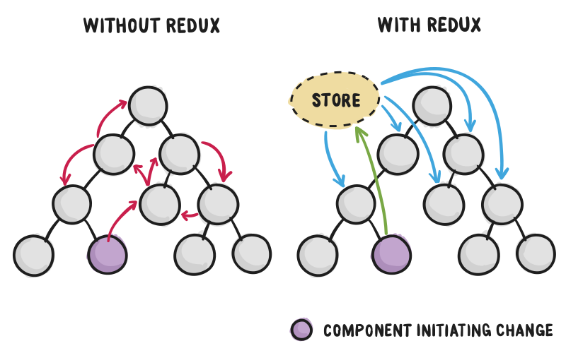
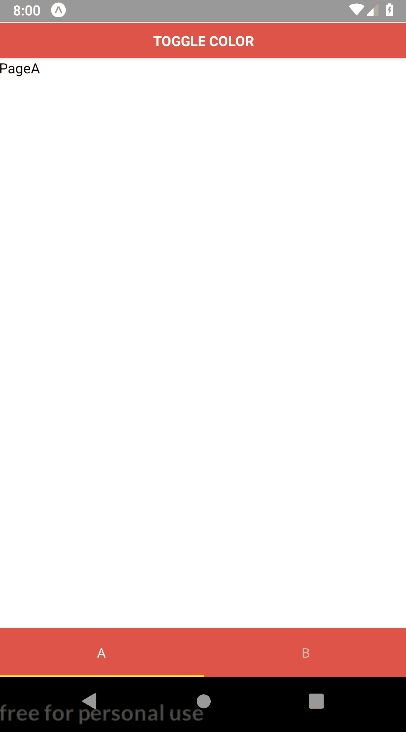

# Theme your Expo app with Redux and React Navigation

Recently whilst developing a React Native app (with Expo),
I built a simple tab navigator using React Navigation library.
I wanted to theme the app so that the header would change colour depending on which page you're on.
For example on the primary page it would be red and on the secondary page, when you change tabs, the
header would become blue.

I ended up being able to do it using Redux. In this article, I will show you how you can theme your Expo
app using Redux with React Navigation.

*P.S*. This article is written in British English however, the code is written using American English to make it more consistent (colour vs color).

---------------------------------------------------------------------------------------------------

## React Navigation

Is a library that helps you simplify app navigation.
The main reason for using this library is because it's written purely in JavaScript so no native code (Swift/Android) is required to make it work. Also, it's the [recommended navigation library](https://docs.expo.io/versions/latest/guides/routing-and-navigation) for Expo.

---------------------------------------------------------------------------------------------------

## Redux

[Redux](https://redux.js.org/) is used to manage global state across a React app, it can actually be used with both React and React Native. Of course, in this example, we will be using Redux with a React Native app.



The diagram above explains pretty well why you may need to use Redux. Passing state can be tricky
in more complicated React Native apps, with lots of components and sub-components. Using redux
we can change the state in one component and Redux will update the state in all the other components.

There are many great tutorials about Redux, I particularly liked this [one](https://www.youtube.com/watch?v=KcC8KZ_Ga2M).
Here is brief summary how Redux will work with this app.

* Redux sets the initial (state) colour to red
* Change tabs from main to the secondary page
* This dispatches an action to the Redux store (action is called `toggleTheme`)
* The store then calls a reducer
* The reducer (also called `toggleTheme`) updates the old state to a new state, it changes the colour from red to blue
* Redux updates the state in all the components

Here is a GIF that might help clear up how it work.


---------------------------------------------------------------------------------------------------

## Prerequisite

* An Expo/React Native app
* An Android emulator/device to test on
* Install the following dependencies

```text
"react-navigation": "^2.18.0",
"react-redux": "^5.1.1",
"redux": "^4.0.1",
```

---------------------------------------------------------------------------------------------------

## Solution

Now to the interesting part of this article let's take a look at the code.

---------------------------------------------------------------------------------------------------

### Structure

The project structure will look like this

```text
├── src
│   ├── actions
│   ├── components
│   ├── containers
│   ├── reducers
│   ├── screens
│   ├── store
|   └── themes
├── package.json
├── App.js
```

---------------------------------------------------------------------------------------------------

### themes

```js
export const COLORS = {
  red: { name: 'red', hexCode: '#DE5448' },
  blue: { name: 'blue', hexCode: '#498AF4' },
}
```

Here we define our two colours that will be used as themes, red and blue. I have given each colour a name because it makes the toggle logic easier to follow.

---------------------------------------------------------------------------------------------------

### reducers

```js
import { COLORS } from '../themes';

const initialState = {
  colorData: COLORS.red,
};

const Theme = (state = initialState, action) => {
  switch (action.type) {
    case 'TOGGLE_THEME':
      switch(action.payload.name) {
        case 'red':
          return { colorData: COLORS.blue };
        case 'blue':
          return { colorData: COLORS.red };
      }
    default:
      return state;
  }
};

export default Theme;
```

A reducer is a pure function which takes some state and returns a new state. In this example
it gets passed the current theme colour and swaps it to the new theme colour.

In this example if the action is `TOGGLE_THEME`, we get the colour name from the payload and using a switch
statement we swap the colours over. So if the current colour is red we update the state (`colorData`) to be
blue.

```js
import { combineReducers } from 'redux';
import Theme from './Theme';

export default combineReducers({
  Theme,
});
```

Here we combine all of our reducers, in this example, we are only using the one reducer but if we had multiple reducers, The `combineReducers` function to would be necessary to combine them together. In this
example we can simply add new reducers to the function as and when we need them.

---------------------------------------------------------------------------------------------------

### actions

```js
export const TOGGLE_THEME = 'TOGGLE_THEME';
```

This file defines all the actions we can dispatch to our store. In this example, we only need one action to
toggle our theme.

```js
import { TOGGLE_THEME } from './actionTypes';

export const toggleTheme = theme => ({
  type: TOGGLE_THEME,
  payload: theme,
});
```

In this file, we define our actions, so here we have a single action `toggleTheme`, which takes a
theme as input and passes it as our payload, hence to access the name of the colour we use `action.payload.name` in our reducer.

---------------------------------------------------------------------------------------------------

### store

```js
import { createStore } from 'redux';
import rootReducer from '../reducers';


export default store = createStore(rootReducer);
```

The Redux store is used to store the current state for our app, we have to link our store with our reducers we can do this using the `createStore` function and import the reducers from `reducers/index.js`.

---------------------------------------------------------------------------------------------------

### App.js

```js
import React, { Component } from 'react';
import { Provider } from 'react-redux';

import store from './src/store';
import CustomTabNavigator from './src/components/CustomTabNavigator';

export default class App extends Component {
  render() {
    return (
      <Provider store={store}>
        <CustomTabNavigator />
      </Provider>
    );
  }
};
```

This acts as the main file for our app, to use Redux with our app we must wrap around `Provider` tags and
set the store props to our `store/index.js` file. The `<CustomTabNavigator>` contains the logic for our two screens and the tab navigator.

---------------------------------------------------------------------------------------------------

### components

```js
import store from '../store';
import { createMaterialTopTabNavigator } from 'react-navigation';

import PageA from '../screens/PageA';
import PageB from '../screens/PageB';
import { COLORS } from '../themes';
import { toggleTheme } from '../actions';


const commonTabOptions = color => ({
  activeTintColor: 'white',
  pressColor: '#fff',
  inactiveTintColor: '#ddd',
  style: {
    backgroundColor: color,
  },
});


const CustomerTabNavigator = createMaterialTopTabNavigator({
  Encoding: {
    screen: PageA,
    navigationOptions: {
      tabBarLabel: 'A',
      tabBarOptions: commonTabOptions(COLORS.red.hexCode),
      tabBarOnPress: ({ _, defaultHandler }) => {
        store.dispatch(toggleTheme(COLORS.blue));
        defaultHandler();
      },
    },
  },
  Decoding: {
    screen: PageB,
    navigationOptions: {
      tabBarLabel: 'B',
      tabBarOptions: commonTabOptions(COLORS.blue.hexCode),
      tabBarOnPress: ({ _, defaultHandler }) => {
        store.dispatch(toggleTheme(COLORS.red));
        defaultHandler();
      },
    },
  },
}, {
    tabBarPosition: 'bottom',
});


export default CustomerTabNavigator
```

Here is where we use react navigation to create our tab navigator. We define two screens called A and B,
each screen has a different tab colour, red for A and blue for B. The main part of this file is the following

```jsx
tabBarOnPress: ({ defaultHandler }) => {
    store.dispatch(toggleTheme(COLORS.red));
    defaultHandler();
},
```

On tab change (from A -> B), we detect the tab press and dispatch the `toggleTheme` action to the Redux
store. So when we change tabs from A -> B the colour in the store will change from Red -> Blue and
vice versa for B -> A.

One other thing to note is the tab colour is set using the following function. The colour is passed by the `tabBarOptions`.

```jsx
const commonTabOptions = color => ({
  activeTintColor: 'white',
  pressColor: '#fff',
  inactiveTintColor: '#ddd',
  style: {
    backgroundColor: color,
  },
});
```

```jsx
tabBarOptions: commonTabOptions(COLORS.red.hexCode)
```

```js
import React, { Component } from 'react';
import { View, Button } from 'react-native';
import { connect } from 'react-redux';

import { toggleTheme } from '../actions';


class ToggleTheme extends Component {
  render() {
    return (
      <View style={{marginTop: 25}}>
        <Button
          title="Toggle Color"
          color={this.props.color.hexCode}
          onPress={() => this.props.toggleTheme(this.props.color)}
        />
      </View>
    )
  }
}

const mapStateToProps = state => ({
  color: state.Theme.colorData,
});

const mapDispatchToProps = dispatch => ({
  toggleTheme: color => dispatch(toggleTheme(color)),
});

export default connect(mapStateToProps, mapDispatchToProps)(ToggleTheme);
```

This file does most of the heavy lifting for this app, this is where most of the logic sits. So, first of all, we have a button, which calls `toggleTheme` on a press of the and passes the current colour (state) as an argument.

```jsx
<Button
  title="Toggle Color"
  color={this.props.color.hexCode}
  onPress={() => this.props.toggleTheme(this.props.color)}
/>
```

The colour of the button is also using the current (state) colour, so in this case, it will start off as red, `this.props.color`. We can access the current state using `this.props`.

```jsx
const mapStateToProps = state => ({
  color: state.Theme.colorData,
});
```

This function is used to map the Redux store to the state of this component. We map `state.Theme.colorData`,
where `Theme` is the name of our reducer and `colorData` is the item name. In this example, we've mapped the current `colorData` to `color` props in this component.

```jsx
const mapDispatchToProps = dispatch => ({
  toggleTheme: color => dispatch(toggleTheme(color)),
});
```

This function maps a function to an action (and dispatches it), in this example when the `toggleTheme` function is called in the component it will dispatch the `toggleTheme` action to redux. So when the
button is pressed it will dispatch an action to toggle the theme.

---------------------------------------------------------------------------------------------------

### PageA

```js
import React, { Component } from 'react';
import { View, Text } from 'react-native';

import ToggleTheme from '../components/ToggleTheme';

export default class PageA extends Component {
  render() {
    return (
      <View style={{ flex: 1 }}>
        <ToggleTheme />
        <Text>PageA</Text>
      </View>
    );
  }
}
```

This is an example of one of our screens, it's very simple just the page name and `<ToggleTheme>` component.

---------------------------------------------------------------------------------------------------

## Example



Here is an example of the app running, as you can see there are two ways we can toggle the theme. We
could use the button click, or change tabs.

*Extra Task*: If you want some practice, currently this won't detect a swipe action to change tabs
look at how you can do this. An example of it working can be found [here](https://gitlab.com/hmajid2301/stegappasaurus/blob/development/src/screens/Decoding.js).

---------------------------------------------------------------------------------------------------

## Appendix

* [Example source code](https://github.com/hmajid2301/medium/tree/master/10.%20Redux%20with%20React%20Navigation)
* [React Navigation](https://reactnavigation.org/)
* [Redux Animation](https://css-tricks.com/learning-react-redux/)
* [Redux Diagram](http://slides.com/jenyaterpil/redux-from-twitter-hype-to-production#)
* [Redux](https://redux.js.org/)
* GIFs created with [screentogif](https://www.screentogif.com/)
* [Code images made with carbon](https://carbon.now.sh)