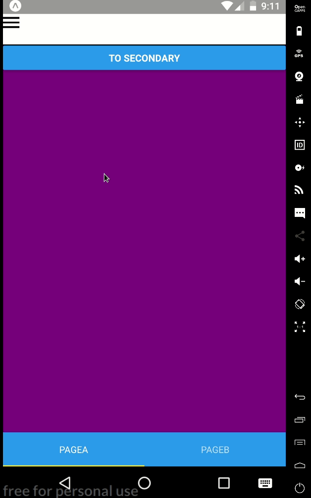
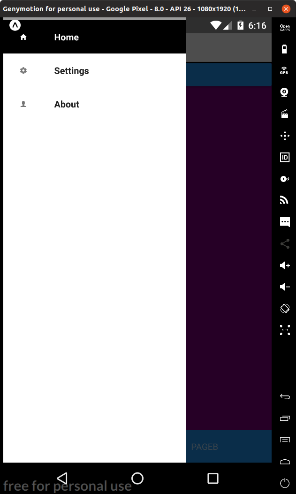
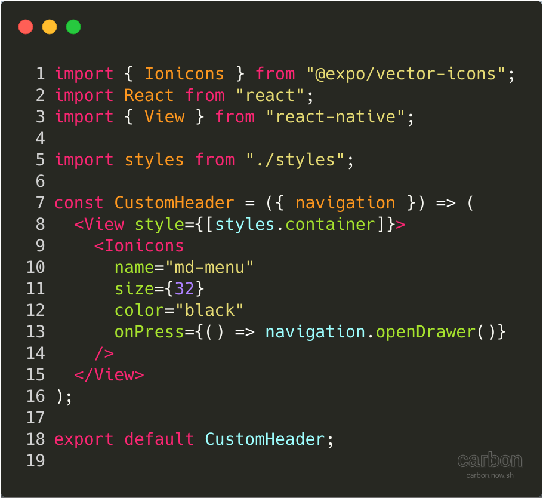
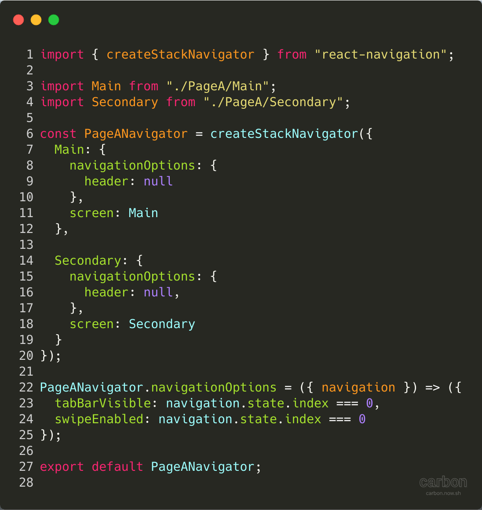

In this article, we will create a simple React Native (with [Expo](https://expo.io/)) application using React
Navigation, for moving between screens/pages within our app. We will create an app which had a Stack Navigator
nested in a Tab Navigator, nested within a Drawer Navigator.

This might sound a bit complicated so let's take a look gif below.



We have three main pages in the Drawer Navigator Home (purple), Settings (red) and About (blue) pages. Inside
the Home page, we have a Tab Navigator which has two pages, PageA (purple) and PageB (green). Within PageA we have a
Stack Navigator with two pages Main (purple) and Secondary (yellow).

## React Navigation

Is a library that helps you simplify app navigation.
The main reason for using this library is because it's written purely in JavaScript so no native code (Swift/Android)
is required to make it work. Also, it's the
[recommended navigation library](https://docs.expo.io/versions/latest/guides/routing-and-navigation) for Expo.

## Structure

The project structure will look like this

```text
├── src
│   ├── components
│   ├── views
|   └── MainApp.js
├── package.json
├── App.js
```

## Drawer Navigator

```js:title=MainApp.js file=./source_code/src/MainApp.js

```

This is where we create our DrawerNavigator with our three main pages, let's take a look at a particular page. Here we
give it the key name `Home`, the `drawerIcon` relates to what Icon will be shown in the Drawer Navigator, the `drawerLabel`
is the name of the page, as shown in the image below. Finally, the `screen` is the actual "jsx" the user sees when they
click on the page. By default, the `Home` page will be the first page the user sees because it is the first page
defined in the navigator.

```jsx
Home: {
  navigationOptions: {
    drawerIcon: ({ tintColor }) => (
        <Ionicons name="md-home" style={{ color: tintColor }} />
    ),
    drawerLabel: "Home"
  },
  screen: Home
},
```



### Custom Drawer Navigator

After we've defined our three pages we then define a custom Drawer Navigator `contentComponent: CustomDrawerNavigator`.
This is a component we make ourselves and can style it however we wish.

```jsx:title=src/components/CustomerDrawerNavigator/CustomDrawerNavigator.js file=./source_code/src/components/CustomDrawerNavigator/CustomDrawerNavigator.js

```

Here the `DrawerItems` are the three pages we've defined above. We give the active page, the page the user is currently
on, a background of black and a colour of white (the text). The line `{...props}` is using the
[spread operator (...)](https://stackoverflow.com/questions/31048953/what-do-these-three-dots-in-react-do),
so we don't have to rewrite all the props passed by React Navigation. For example, we have props like `onItemPress`
or `navigation`. This is the same Drawer Navigator shown in the image above.

## Tab Navigator

So our Tab Navigator allow us to swap pages by changing tabs. The Tab Navigator will be on the home page, so
`Home.js` has the following code.

```js:title=Home.js file=./source_code/src/views/Home.js

```

### Custom Header

Where the custom header looks like so.



```jsx:title=CustomHeader.js file=./source_code/src/components/CustomHeader/CustomHeader.js

```

This component is just a simple icon, which when pressed, opens the Drawer Navigator using the `navigation` props we
passed to the component `onPress={() => navigation.openDrawer()}`.

**Note:** We could also swipe right to open the Drawer Navigator (from the left hand side of the screen).

In the parameters we use the following syntax `({ navigation })`, this is called
[destructuring](https://hacks.mozilla.org/2015/05/es6-in-depth-destructuring/). We can use this with arrays or
objects for example;

```jsx
const temp = {
  a: 10,
  b: 20,
};

// We could do
const a = temp.a;
const b = temp.b;

// Or
const { a, b } = temp;
```

We do as similar thing with the props, rather then referring to `navigation` as `props.navigation` and passing a
parameter `props` instead of `({ navigation })`, this simplifies our code a little bit and makes it easier to follow.

### Custom Tab Navigator

The custom Tab Navigator is similar to the `MainApp.js`'s Drawer Navigator.

```jsx:title=CustomTabNavigator.js file=./source_code/src/components/CustomTabNavigator/CustomTabNavigator.js

```

We give it the two pages we want to be "navigatable" via tabs in this case `PageA` and `PageB`, we then define
the tab to be at the bottom (rather than the top) of the screen. By default `PageA` will be the page we
visit when we go `Home` page because it's the first page defined in the Tab Navigator.

---

## Stack Navigator

In this example, PageB (second page on Tab Navigator) is just a simple page. The stack navigator exists on
`PageA`.



```jsx:title=PageA.js file=./source_code/src/views/Home/PageA.js

```

Again this is very similar to our other navigators we've defined. Here we define two pages that we can navigate between,
like before the `Main` page is the page we visit by default. So the first page the user will see when you open the app
is the `Main` page. This is because when the app is first opened we visit the `Home` page (first in the Drawer Navigator),
which contains `PageA` (first in Tab Navigator), which contains `Main` (first in Stack Navigator).

In the code, we set `header: null` else part of the screen will be taken up by a navigation header, as shown in the
image below.


```jsx
PageANavigator.navigationOptions = ({ navigation }) => ({
  tabBarVisible: navigation.state.index === 0,
  swipeEnabled: navigation.state.index === 0,
});
```

The first page in the Stack Navigator (`Main`) has an index of 0, so `navigation.state.index === 0` evaluates as true.
So on the `Main` page we will see the tab bar and can swipe to change tabs but we cannot do this on the second page
`Secondary`.

### Main

So now we have a Stack Navigator but we have no obvious way to get from `Main` to `Secondary`. With the
Drawer Navigator and Tab Navigator, we can press buttons to change.

```js:title=src/views/Home/PageA/Main.js file=./source_code/src/views/Home/PageA/Main.js

```

We can do this by creating our button in `Main` which when pressed navigates us to `Secondary` page,
`onPress={() => this.props.navigation.navigate("Secondary")}`. Where "Secondary" is the page name to
change to.

## Other Pages

All the other pages are very basic and look something like this, simple background and not much else.

```js:title=src/views/Settings.js file=./source_code/src/views/Settings.js

```

## Appendix

- [Example source code](https://gitlab.com/hmajid2301/articles/-/tree/master/11.%20React%20Navigation%20with%20React%20Native/source_code)
- [React Navigation](https://reactnavigation.org/)
- [Genymotion emulator](https://www.genymotion.com/)
- GIFs created with [screentogif](https://www.screentogif.com/)
