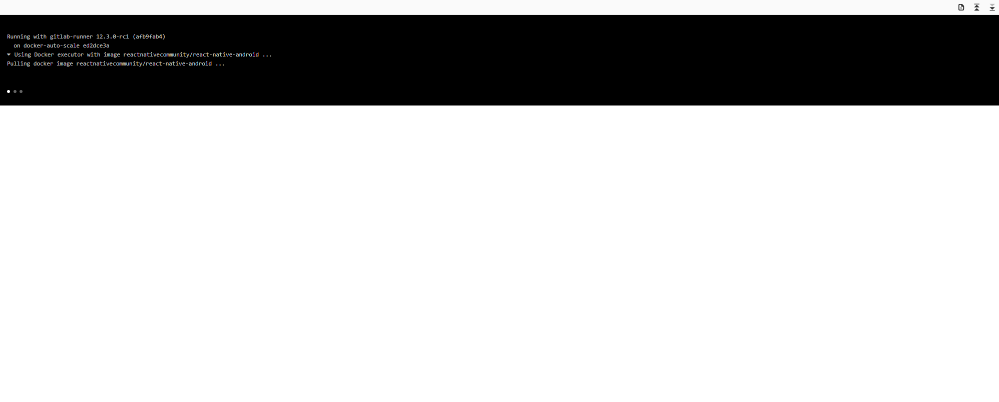

In this article I will show how you can use the GitLab CI with React Native to create a binary which can be published to the
Google Play Store.

## Prerequisites

- [Google Developers Account](https://play.google.com/apps/publish/signup/#EnterDetailsPlace)
- A working React Native Android project

---

## Keystore

First, we have to generate a keystore which we will use to sign our APK. To do this run the commands below,
follow all the instructions and keep the file safe.

```bash
# Used to generate our keystore
keytool -genkeypair -v -keystore my-key.keystore -alias my-key-alias -keyalg RSA -keysize 2048 -validity 10000
# Used to encode our keystore in base64
base64 my-key.keystore > base64-keystore.txt
```

### App signing

We no longer need to upload a certificate manually, as long as you "Opt In", to let Google Sign your applications for you.
It will keep track of the key you used to upload your very first APK file, then it will expect you to sign all new releases
of that application using that same key, so don't lose your keystore. To allow Google to sign our app for us do the following;

- Login to [Google Play Console](https://play.google.com/apps/publish)
- Select your application from the list
- Select "App Releases"
- Select a track, for example "Internal test" > "Manage"
- Select "Create Release"
- Then where it says `Let Google manage and protect your app signing key (recommended)`, Select "Continue"

The signing process works as follows;

- You digitally sign each release using your upload key (upload key being the keystore we just generated) before publishing it on the Play Console.
- Google Play uses the upload certificate to verify your identity and then re-signs your release using the app signing key for distribution.

### GitLab

Now, let's move on to the relevant keystore information to GitLab CI variables, so we can access them during our CI jobs.
First, go to your GitLab project;

- Settings (side menu) > CI/CD > Variables
- Add Type: Variable, key: `ANDROID_KEYSTORE_ALIAS` , value: `my-key-alias`
- Add Type: Variable, key: `ANDROID_KEYSTORE_PASSWORD`, value: (whatever password you used)
- Add Type: Variable, key: `ANDROID_KEYSTORE_KEY_PASSWORD`, value: (whatever password you used, by default it's the same as the `ANDROID_KEYSTORE_PASSWORD`)
- Add Type: `File`, key: `ANDROID_KEYSTORE`, value: (copy the contents of `base64-keystore.txt`)

Now we have all our keystore values/files on GitLab CI.

**Note** Check the project permissions so only the relevant users can see/edit these values.
You should keep the keystore file/passwords private, make sure only the relevant users can access them.

---

## app/build.gradle

Next open the `android/app/build.gradle`, then add the following to the `android{}` section.

```groovy
android {
    ...

    signingConfigs {
        release {
            if (project.hasProperty('MYAPP_RELEASE_STORE_FILE')) {
                storeFile file(MYAPP_RELEASE_STORE_FILE)
                storePassword MYAPP_RELEASE_STORE_PASSWORD
                keyAlias MYAPP_RELEASE_KEY_ALIAS
                keyPassword MYAPP_RELEASE_KEY_PASSWORD
            }
        }
    }

    buildTypes {
        release {
            minifyEnabled enableProguardInReleaseBuilds
            proguardFiles getDefaultProguardFile("proguard-android.txt"), "proguard-rules.pro"
            signingConfig signingConfigs.release
        }
    }

    ...
}
```

All this does is generate a signed APK so we can upload it to the Android Play Store. It will use the
values from the keystore we just generated, to sign our application. We will create a `gradle.propeties`
file so we don't have to store our keystore values in plain-text within the `app/build.gradle`
(The `gradle.properties` file will be generated during our CI job, using the values we stored earlier on GitLab)

**Note**: I have added my `gradle.properties` file to my `.gitignore` file so it doesn't accidentally get committed
when I am testing out the build process locally. I recommend you do the same.

---

## package.json

Add the following three scripts to your `package.json` file. This is so that we can simply use `yarn run bundle`
for example instead of having to write out the whole command, in our GitLab CI. Also, the other advantage is
if the command is used multiple times in our GitLab CI jobs, we only have to edit in a single place.

- build-package: Builds our APK file
- bundle: Bundles all of our react native code into a single file
- generate-gradle-properties: Creates a gradle.properties file for us in the `android folder`.

```json
{
  "scripts": {
    "android-package": "cd android && ./gradlew assembleRelease",
    "bundle": "react-native bundle --platform android --dev false --entry-file index.js --bundle-output android/app/src/main/assets/index.bundle --sourcemap-output android/app/src/main/assets/index.map --assets-dest android/app/src/main/res",
    "generate-gradle-properties": "sh generate-gradle-properties.sh > android/gradle.properties",
    ...
  }
  ...
}
```

Where the `generate-gradle-propeties.sh` file looks something like, the code below.
The file is essentially a template file, where the `${variable}` are determined by
the environment variables set (the values we set earlier on GitLab). So, in this case,
the GitLab CI will pass in our keystore variables as environment variables and this
file will simply fill them in and will create our `gradle.properties` file.

```bash
#!/usr/bin/env bash

cat  << EOF
android.useAndroidX=true
android.enableJetifier=true
MYAPP_RELEASE_STORE_FILE=my-key.keystore
MYAPP_RELEASE_STORE_PASSWORD=${ANDROID_KEYSTORE_PASSWORD}
MYAPP_RELEASE_KEY_ALIAS=${ANDROID_KEYSTORE_ALIAS}
MYAPP_RELEASE_KEY_PASSWORD=${ANDROID_KEYSTORE_KEY_PASSWORD}
EOF
```

---

## .gitlab-ci.yml

Add the following job to your `.gitlab-ci.yml` file, this job will create our APK.

```yaml
stages:
  - build
---
build:android:package:
  stage: build
  image: reactnativecommunity/react-native-android
  script:
    - echo fs.inotify.max_user_watches=524288 | tee -a /etc/sysctl.conf && sysctl -p
    - yarn install
    - base64 -d $ANDROID_KEYSTORE > android/app/my-key.keystore
    - yarn generate-gradle-properties
    - yarn bundle
    - yarn android-package --no-daemon
  artifacts:
    paths:
      - ./android/app/build/outputs/
```

Let's break this job down line by line;
First we need a Docker image which contains all the prerequisites for building our APK. I think the
[reactnativecommunity/react-native-android](https://hub.docker.com/r/reactnativecommunity/react-native-android)
has everything we need for our React Native/Android build (Java, Android SDK etc).

Depending on your exact project, you may need to increase the `inoitfy file watcher` limit, you can do this using
`echo fs.inotify.max_user_watches=524288 | tee -a /etc/sysctl.conf && sysctl -p`. Essentially, file watchers are used
to monitor changes in the file system. You can find more information about
Linux's inotify [here](https://github.com/guard/listen/wiki/Increasing-the-amount-of-inotify-watchers).

We then install our project dependencies using `yarn install`.

We then decode the keystore file `base64 -d $ANDROID_KEYSTORE > android/app/my-key.keystore` the file need to be saved in
`android/app` folder so it can be used during the building of the APK.

We then generate our `gradle.properties` file using `yarn generate-gradle-properties`, where we store variables required during the
build process such as the keystore passsword.

Then we run `yarn bundle`, which creates the bundle, where all of our (JavaScript) React Native file are bundled into a single Javascript
file.

Finally we run the command that will actually build our APK `yarn android-build-apk --no-daemon`. Since this is a `CI` job we
don't need to start a daemon, to speed up future builds hence the `--no-daemon` argument.

Also we make some build artifacts available so everything with in this folder, `./android/app/build/outputs/` can be accessed/downloaded
the APK after the job has completed, so we can then upload our APK manually.

### AAB

An AAB is the [Android App Bundle](https://developer.android.com/guide/app-bundle), which is now the recommended
way to upload our app to the Play Store. It has a few advantages over the APK, the main one being it usually
makes your app slimmer and takes fewer bytes on your users device's. Luckily for us the change in code required to
create an AAB instead of an AAB is very small.

All we have to do is open our `package.json` and edit the `android-package` script so that it contains the following
`"android-package": "cd android && ./gradlew bundleRelease"`. So essentially we change the Gradle target from
`assembleRelease` to `bundleRelease` and that it.



---

## Appendix

- [Example project](https://gitlab.com/hmajid2301/stegappasaurus/blob/4eb78b18e5677b9f6956750d50ea50725c4d099f)
