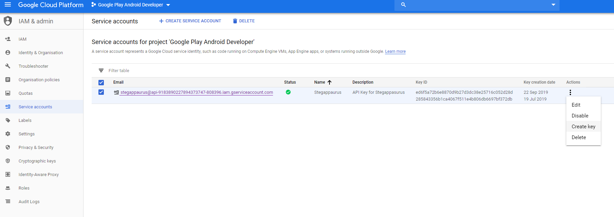
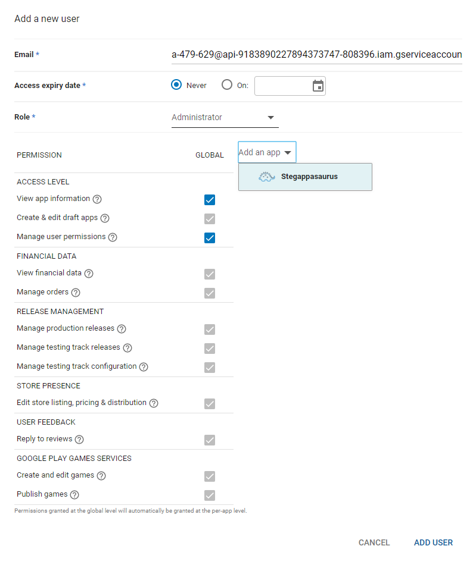

In this article, I will show you how can automate the publishing of your AAB/APK to the `Google Play Console`.
We will be using the [Gradle Play Publisher](https://github.com/Triple-T/gradle-play-publisher) (GPP) plugin to do
automate this process for us. Using this plugin we cannot only automate the publishing and release of our app,
we can also update the release notes, store listing (including photos) all from GitLab CI.

**Note:** In this article I will assume that you are using Linux and React Native version >= 0.60.

## Prerequisites

- [Google Developers Account](https://play.google.com/apps/publish/signup/#EnterDetailsPlace)
- A working React Native Android project.

## Google Play Console

First, we need to create a service account, this account will be used to make changes to our app
automatically, such as publish it or change the store listing.

- Go to the [Google Play Console](https://play.google.com/apps/publish)
- Go to "Settings"
- Go to "Developer Account"
- Select "API access"
- Click the "Create Service Account" button
- Click the "Google API Console" button, this will take you to the `Google Cloud Platform`
- Click "Create Service Account", give your service account a `name` and a `description`
- Select the `Role` as `Owner`, select the "Continue" button and then finally select "Done"
- After creating your service account you should have a file automatically downloading `api<...>.json`, if not click on "Actions (3 Dots) > Create Key", as shown in `Image 1`
- Now go back to "Play Console"
- Go to "Service Accounts" (on the current page), and select "Grant Access"
- Next set the permission as shown in `Image 2`

If you would like, you can set the permissions either globally so you can use this account for all your apps,
or you can specify an app so that you will create a new account each time you want to auto-publish a new app.
Each approach has its own advantages, the first approach is more convenient. However, the second approach is
more safe, for example, if your credentials are leaked, only one of your apps is affected.





## GitLab

Now we need the JSON file we just downloaded to be accessible by our GitLab CI jobs, where the JSON file should
look something like this;

```json
{
  "type": "service_account",
  "project_id": "xxx",
  "private_key_id": "xxx",
  "private_key": "xxx",
  "client_email": "xxx",
  "client_id": "xxx",
  "auth_uri": "https://accounts.google.com/o/oauth2/auth",
  "token_uri": "https://oauth2.googleapis.com/token",
  "auth_provider_x509_cert_url": "https://www.googleapis.com/oauth2/v1/certs",
  "client_x509_cert_url": "xxx"
}
```

Now, let's move the relevant keystore information to GitLab CI variables, so we can access them during our CI jobs.
First, go to your GitLab project;

- Settings > CI/CD > Variables
- Add Type: File, Key: PLAY_STORE_JSON, Value: (the contents of your JSON file)

**Note:** When I'm testing locally sometimes I store this JSON file locally, so I include it in my `.gitignore` (I call mine `play-store.json`) file
so it doesn't accidentally get published online.

## build.gradle

We need to edit the `android/build.gradle` file first. The Maven URL is a place where we can download
the GPP plugin. The dependencies list the plugins we want to download and their versions.

```groovy
buildscript {
    ...
    repositories {
        ...
        maven {
            url "https://plugins.gradle.org/m2/"
        }
    }
    dependencies {
        classpath "com.android.tools.build:gradle:3.5.0"
        classpath "com.github.triplet.gradle:play-publisher:2.4.1"
    }
    ...
}
```

### gradle-wrapper.properties

To use GPP version `2.4.1` we need to use gradle version >= 5.6.1. To do this we open
`android/gradle/wrapper/gradle-wrapper.properties` and edit the line `distributionUrl` so that the gradle version match
the required version for example `distributionUrl=https\://services.gradle.org/distributions/gradle-5.6.1-all.zip`.

## app/build.gradle

We also need to edit our `android/app/build.gradle`.
Add the `apply plugin: "com.github.triplet.play"` to the top of your file after `apply plugin: "com.android.application"`.
Then at the bottom of the file add the code below. This is what the GPP plugin uses to determine how to publish your app.
In this case, it will

- defaultToAppBundles: It will generate an AAB (Android App Bundle) instead of APK
- track: Which track we should deploy the new AAB to, you can chose for example production or beta, in this case it's the internal track
- serviceAccountCredentials: The location of the Play Store JSON we stored in our CI/CD variables in this example it will be kept in `android/app/play-store.json`
- resolutionStrategy: Automatically updates the app's version code to matches the next available number required so it's published

```groovy
play {
    defaultToAppBundles = true
    track = "internal" // beta, alpha, production.
    serviceAccountCredentials = file("./play-store.json")
    resolutionStrategy = "auto"
    outputProcessor {
        versionNameOverride = "$versionNameOverride.$versionCode"
    }
}
```

There are numerous more options you can enable/use, such as generating a draft which you can manually publish yourself from the Play store console.
You can find more details [here](https://github.com/Triple-T/gradle-play-publisher), in the GPPs very well documented README.

## Meta Data

You can also use the GPP to publish meta-data about our app such as the listing, photos etc. To do this you can either
run `cd android && ./gradlew bootstrap` which will initialise the directory layout you need and also pull the
information from the play store if you already have it. If you do not want to run this command, you can create a
structure similar to the one shown below in your `android/app/src/main/play/` folder. You can find more information
about meta-data [here](https://github.com/Triple-T/gradle-play-publisher#managing-play-store-metadata).

```text
├── contact-email.txt
├── contact-website.txt
├── default-language.txt
├── listings
│   └── en-GB
│       ├── full-description.txt
│       ├── graphics
│       │   ├── feature-graphic
│       │   │   └── 1.png
│       │   ├── icon
│       │   │   └── 1.png
│       │   └── phone-screenshots
│       │       ├── 1.png
│       │       ├── 2.png
│       │       ├── 3.png
│       │       ├── 4.png
│       │       ├── 5.png
│       │       └── 6.png
│       ├── short-description.txt
│       ├── title.txt
│       └── video-url.txt
├── release-names
│   └── default.txt
└── release-notes
    └── en-GB
        └── default.txt
```

## package.json

Add the following script to your `package.json`, this will be used within our `.gitlab-ci.yml`. This is so that we can
simply use yarn run bundle, for example instead of having to write the whole command, in our GitLab CI. Also, the other
advantage is that the command is used multiple times in our GitLab CI jobs, we only have to edit in a single location. It also
saves us having to type out the same (very long) command again.

- bundle: Bundles all of our react native code into a single file
- publish-package: Will build our AAB and also publish it along with all the meta-data we include

```json
{
  ...
  "scripts": {
    "bundle": "react-native bundle --platform android --dev false --entry-file index.js --bundle-output android/app/src/main/assets/index.bundle --sourcemap-output android/app/src/main/assets/index.map --assets-dest android/app/src/main/res",
    "publish-package": "cd android && ./gradlew publishRelease",
    ...
  }
  ...
}
```

## .gitlab-ci.yml

Now finally we can add our job to our GitLab CI file.

```yaml
stages:
  - publish

publish:android:package:
  stage: publish
  image: reactnativecommunity/react-native-android
  script:
    - echo fs.inotify.max_user_watches=524288 | tee -a /etc/sysctl.conf && sysctl -p
    - mv $PLAY_STORE_JSON android/app/play-store.json
    - yarn bundle
    - yarn publish-package --no-daemon
  artifacts:
    paths:
      - ./android/app/build/outputs/
```

Let's break this file down line by line;
We need a Docker image which contains all the prerequisites for building our APK. A good one
to use is the [reactnativecommunity/react-native-android](https://hub.docker.com/r/reactnativecommunity/react-native-android).
It has everything we need for React Native/Android (Java, Android SDK etc).

Depending on your exact project, you may need to increase the inoitfy file watcher limit. You can do this by using
`echo fs.inotify.max_user_watches=524288 | tee -a /etc/sysctl.conf && sysctl -p`. Essentially file watchers are used
to monitor changes in the file system. You can find more information about
Linux's inotify [here](https://github.com/guard/listen/wiki/Increasing-the-amount-of-inotify-watchers).

`yarn bundle`: We create a bundle this is where all of our (JavaScript) React Native file are bundled into a single Javascript
file.

`yarn android-publish --no-daemon`: This builds our AAB locally and then publish it to the `Android Play Store`, to the internal testing track in this case.
It will also publish all of our meta-data for us such as the photos, store listing, contact information and release notes (etc).
Since this is a CI job we don't need to start a daemon, to speed up future builds, hence the `--no-daemon` argument.

Finally we create artifacts `./android/app/build/outputs/` so that we can download the AAB after the job has been completed. I also like to include
my artifacts (AAB) with releases of my apps within GitLab. It makes it easier to track what version of the app was released when. But if you don't
want the AAB/APK you can simply remove the artifacts part from the job.

That's it, we're done :).


## Appendix

- [Example project](https://gitlab.com/hmajid2301/stegappasaurus/tree/cde1afd6fbb9d882bccb9e05693824587ce1b77e)
- [Gradle Play Publisher](https://github.com/Triple-T/gradle-play-publisher)
