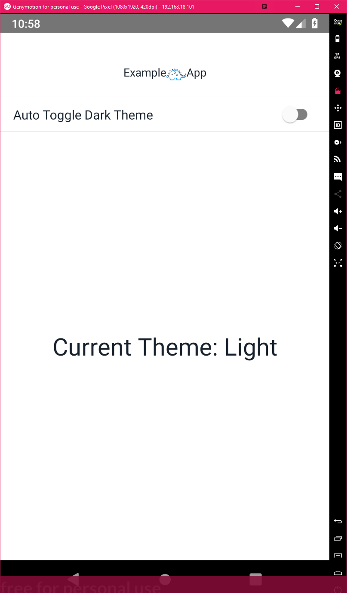
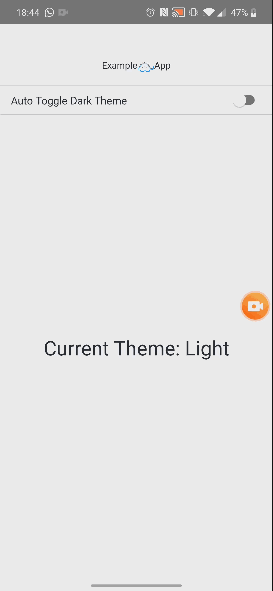

In this article, I will show you how you can change the theme of your app depending on
the time of the day. We will change the theme of the app depending on if the sun has set or risen.

## Our Application

To get started we will create a new React Native app by running the following command,
`react-native init ExampleApp --template typescript`.

- [Source Code](https://gitlab.com/hmajid2301/medium/tree/master/19.%20Theme%20your%20React%20Native%20app/ExampleApp)

_Note_: We are using path aliases so `~` is the same as saying `src/`, this keeps the
import paths cleaner. More information [here](https://medium.com/analytics-vidhya/better-imports-with-typescript-aliases-babel-and-tspath-5c3addc7bc9e) #ShamelessPlug.

---

### AutoTheme.tsx

First, let's create the module which will contain the core logic for this app.
This module will be used to determine if we should toggle the dark theme on or off.
It does this by using the user's current location, using the
[react-native-location](https://github.com/timfpark/react-native-location) library.
Then working out the sunrise and sunset at that location, using [sunrise-sunset-js](https://github.com/udivankin/sunrise-sunset).

However, we will only check the location once per day, we store the latitude and longitude locally
on the device and if it within a day since it was set, then we use these locally stored values.
However if the stored values are older than a day then we find the new latitude and longitude,
use those and replace the old values with these new values.

The AutoTheme is a class, let's take a look at the main function of the class

```typescript
export default class AutoTheme {
  private static oneDay = 24 * 60 * 60 * 1000;

  public async shouldToggleDarkTheme() {
    const currentTime = new Date(Date.now());
    const { sunrise, sunset } = await this.getSunriseAndSunsetTime(currentTime);
    let toggleTheme = true;

    if (sunrise !== null && sunset !== null) {
      if (currentTime > sunrise && currentTime < sunset) {
        toggleTheme = false;
      }
    }

    return toggleTheme;
  }
  // ...
}
```

The logic is fairly simple

- Get the current time
- Get the time the sun will rise/set
- If the current time is between sunrise and sunset
  - then leave the theme light (return false, i.e. don't toggle the theme to dark)
- else
  - toggle the theme to dark

In the example below, we would toggle the dark theme on because the sun has already set for that day.

```text
currentTime = 5.48pm
sunrise = 6.30am
sunset = 4.45pm
```

So how do we get the sunrise/sunset time ? First, we need to get the latitude and longitude.
Then using the latitude and longitude we work out the sunset and sunrise times (for the current day).
Sometimes with the sunset-sunrise library, it will show you the sunrise for the next day.
If this is the case we simply remove a day from the sunrise date, so we're always
comparing the sunrise/sunset and current time on the same day.

```typescript
  private async getSunriseAndSunsetTime(currentTime: Date) {
    const {latitude, longitude} = await this.getLatitudeLongitude();
    let sunrise = getSunrise(latitude, longitude, currentTime);
    const sunset = getSunset(latitude, longitude, currentTime);

    if (sunrise > sunset) {
      sunrise = new Date(sunset.getTime() - AutoTheme.oneDay);
    }
    return {sunset, sunrise};
  }
```

As stated above we get the latitude-longitude data either from local storage (async storage),
or we get completely new latitude-longitude data from the users's current location.
We check if the stored location is older than a day and if it is we get the user's current location.

```typescript
  private async getLatitudeLongitude() {
    const currentDate = new Date(Date.now());
    const lastQueried = await AsyncStorage.getItem('@LastQueriedLocation');
    let latitude: number;
    let longitude: number;
    let lastQueriedDate: Date;

    if (lastQueried) {
      lastQueriedDate = new Date(lastQueried);
    } else {
      lastQueriedDate = new Date(currentDate.getTime() - AutoTheme.oneDay);
    }

    if (currentDate.getTime() - lastQueriedDate.getTime() >= AutoTheme.oneDay) {
      ({latitude, longitude} = await this.getNewLatitudeLongitude(currentDate));
    } else {
      latitude = Number(await AsyncStorage.getItem('@Latitude'));
      longitude = Number(await AsyncStorage.getItem('@Longitude'));
    }

    return {latitude, longitude};
  }
```

The final function is used to get the user's current location (latitude and longitude), we then store this
current location in local storage (async storage), alongside the current date. This date is used to check
later on if we need to get the user's location again.

```typescript
  private async getNewLatitudeLongitude(currentDate: Date) {
    let latitude;
    let longitude;

    const granted = await RNLocation.requestPermission({
      ios: 'whenInUse',
      android: {
        detail: 'coarse',
      },
    });

    if (granted) {
      let location: Location | null;
      try {
        location = await RNLocation.getLatestLocation({timeout: 60000});
      } catch {
        Snackbar.show({
          title: 'Failed to get location, please check it is turned on',
        });
        throw Error('No location found');
      }

      if (location !== null) {
        latitude = location.latitude;
        longitude = location.longitude;

        await Promise.all([
          AsyncStorage.setItem('@Latitude', JSON.stringify(latitude)),
          AsyncStorage.setItem('@Longitude', JSON.stringify(longitude)),
          AsyncStorage.setItem(
            '@LastQueriedLocation',
            JSON.stringify(currentDate),
          ),
        ]);
      }
    }

    if (latitude === undefined || longitude === undefined) {
      throw Error('No location found');
    }

    return {latitude, longitude};
  }
```

---

### ThemeContext.tsx

Next, let's take a look at the module in charge of actually changing our theme and storing the current
theme (used by the other components). We will use React's Context, React Contexts can be used to store the
global state of our application. Such as our current theme, this can then be accessed anywhere in our
application and also changed anywhere.

> Context provides a way to pass data through the component tree without having to pass props down manually at every level. - https://reactjs.org/docs/context.html

In our case, we don't want to have to pass the Theme to every component as a prop. So we store it in our a React
context. Firstly, we define some types that will be used in our React context file, such as the light and
dark theme constants.

```typescript
import React, { Context, createContext, useState } from "react";

type ThemeColors = "#17212D" | "#FFF";

interface ITheme {
  background: ThemeColors;
  color: ThemeColors;
  isDark: boolean;
}

const LIGHT_THEME: ITheme = {
  background: "#FFF" as ThemeColors,
  color: "#17212D" as ThemeColors,
  isDark: false,
};

const DARK_THEME: ITheme = {
  background: "#17212D" as ThemeColors,
  color: "#FFF" as ThemeColors,
  isDark: true,
};

interface IThemeContext {
  theme: ITheme;
  changeTheme: (isDark: boolean) => void;
}
```

Next, we create our context with some default values. This then allows us to access the provider
and consumer (`ThemeContext.Provider`);

- Provider: The component that will provide the value of the context (stored).
- Consumer: The component that will consume the value

_Note_: We will not use the consumer part in our app because we are accessing the value
in other ways (React hooks).

```typescript
const ThemeContext: Context<IThemeContext> = createContext({
  changeTheme: (_: boolean) => {
    return;
  },
  theme: LIGHT_THEME,
});
```

Now let's define our provider.

```tsx
const ThemeProvider: React.FC = ({ children }) => {
  const [themeState, setTheme] = useState({
    theme: LIGHT_THEME,
  });

  const changeTheme = (isDark: boolean) => {
    setTheme({
      theme: isDark ? DARK_THEME : LIGHT_THEME,
    });
  };

  return (
    <ThemeContext.Provider
      value={{
        changeTheme,
        theme: themeState.theme,
      }}
    >
      {children}
    </ThemeContext.Provider>
  );
};
```

The `useState` function is a React hook, which returns the current state `themeState` and function
to change the state `setTheme`, in this case, we can pass theme (light theme as default) so that the state
can only be a theme object, cannot change it to say 0.

```tsx
const [themeState, setTheme] = useState({
  theme: LIGHT_THEME,
});
```

Then we define the function that can change our theme, if `isDark` is `true` then the
theme becomes dark else it becomes light.

```tsx
const changeTheme = (isDark: boolean) => {
  setTheme({
    theme: isDark ? DARK_THEME : LIGHT_THEME,
  });
};
```

Finally, we define the actual component for theme provider, it takes in any React component. This way any component
surronded by the provider can access/change the app theme.
We need to give the provider a function to change the value and the value itself.

```tsx
return (
  <ThemeContext.Provider
    value={{
      changeTheme,
      theme: themeState.theme,
    }}
  >
    {children}
  </ThemeContext.Provider>
);
```

---

### App.tsx

We use our provider in the main function

```tsx
import React from "react";

import { ThemeProvider } from "~/providers/ThemeContext";
import MainApp from "~/MainApp";

export default class App extends React.Component<{}, {}> {
  public render() {
    return (
      <ThemeProvider>
        <MainApp />
      </ThemeProvider>
    );
  }
}
```

---

### MainApp.tsx

Now we have the logic to determine if we should change to a dark theme, depending on the time of day.
But how/when do we call this auto theme module, well this is done through the `MainApp.tsx` module.
Below is a very simple page, with a logo (that changes depending on the theme) a switch
to turn on auto-theme and the current theme displayed i.e. light or dark.

```tsx
  // Access Theme context within this React class.
  public static contextType = ThemeContext;
  public context!: React.ContextType<typeof ThemeContext>;

  // Set default state for the class.
  public state = {
    autoTheme: false,
    autoToggleTheme: new AutoTheme(),
  };

  public render() {
    const theme = this.context.theme;
    return (
      <View style={{flex: 1, backgroundColor: theme.background}}>
        <Header />
        <ListItem
          containerStyle={{
            backgroundColor: theme.background,
          }}
          topDivider={true}
          bottomDivider={true}
          titleStyle={{color: theme.color}}
          title="Auto Toggle Dark Theme"
          switch={{
            onValueChange: this.autoTheme.bind(this, !this.state.autoTheme),
            thumbColor: 'white',
            trackColor: {false: 'gray', true: 'blue'},
            value: this.state.autoTheme,
          }}
        />

        <View style={{flex: 1, justifyContent: 'center', alignItems: 'center'}}>
          <Text style={{color: theme.color, fontSize: 30}}>
            Current Theme: {this.context.theme.isDark ? 'Dark' : 'Light'}
          </Text>
        </View>
      </View>
    );
  }

  // ...
```



The theme is changed using the line `this.context.changeTheme(isDark);` essentially sets the theme for the app.
We can then do something like `this.context.theme.color` to get the current colour or
`this.context.theme.background` to get the background colour the app should be using.

```typescript
  // Called when the switch is toggled
  private autoTheme = async (value: boolean) => {
    this.setState({autoTheme: value});
    let isDark = false;
    if (value) {
      isDark = await new AutoTheme().shouldToggleDarkTheme();
    }

    this.context.changeTheme(isDark);
  };

  // ...
```

The other key function is this one, where we listen for when the app goes from background
to the foreground, if this happens we then call the auto theme module and check if we should
toggle the theme, say you do this between sunsets. You background the app at 6.58 PM, the
sunsets at 7.0 2PM and you foreground the app at 7.04 PM then when the user returns
`this.context.changeTheme(true)` will be called like this (true) and then the values
returned by `this.context.theme` would change to the dark theme.

```typescript
import {..., AppState} from 'react-native';

  public async componentDidMount() {
    AppState.addEventListener('change', this.appInFocus);
  }

  public componentWillUnmount() {
    AppState.removeEventListener('change', this.appInFocus);
  }

  private appInFocus = async (nextAppState: any) => {
    if (nextAppState === 'active' && this.state.autoTheme) {
      const isDark = await this.state.autoToggleTheme.shouldToggleDarkTheme();
      this.context.changeTheme(isDark);
    }
  };
```

---

### Header.tsx

We have a single component in the MainApp page, which is a header, the header
will change logos depending on what the current theme is (again using context).
Here we are using React Hooks with our React Theme Context. Without needing to pass the theme as a prop.
This is particularly useful is this component was a is few levels deep, without
the hook we would need to keep passing the theme as a prop
to the child of a component from the parent, then that component would pass it to it's
child etc.

The context allows us have a global state throughout our app and
the hooks allow us to access this state without needing to turn our components into a class.
Though as you have seen we can also access the context within our React classes.

```tsx
import { Header as ElementsHeader } from "react-native-elements";

import logoDark from "~/assets/images/logo-dark.png";
import logoLight from "~/assets/images/logo-light.png";
import { ThemeContext } from "~/providers/ThemeContext";

const Header = () => {
  const { background, color, isDark } = useContext(ThemeContext).theme;

  return (
    <ElementsHeader
      containerStyle={{ backgroundColor: background }}
      centerComponent={
        <View style={{ flexDirection: "row", flexWrap: "wrap" }}>
          <Text style={{ color }}>Example</Text>
          <Image
            source={isDark ? logoLight : logoDark}
            style={{ height: 25, width: 25 }}
          />
          <Text style={{ color }}>App</Text>
        </View>
      }
    />
  );
};
```

---

## Run the app

```bash
git clone git@gitlab.com:hmajid2301/medium.git
cd "medium/19. Theme your React Native app/ExampleApp"
yarn
yarn run start

# Then in another terminal
yarn run android
```

---

## Example App

Here is a GIF of the app running.



---

## Appendix

That's it we successfully created an app that auto changes the user's theme depending on
the time of day, using the user's location to determine sunrise and sunset.
