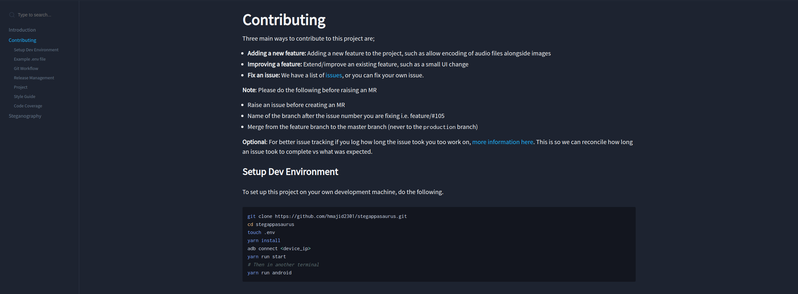
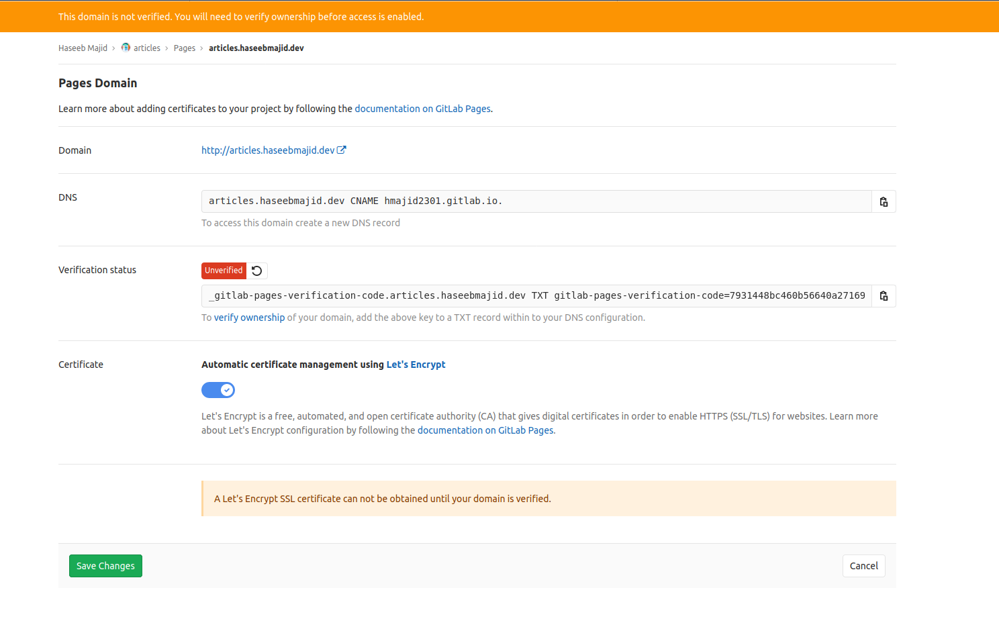

In this article I will show you how you can deploy a Docz website on Gitlab pages, using `.gitlab-ci.yml`.
Most of this article should be applicable to Github pages as well.

## Docz

[Docz](https://www.Docz.site/) is a tool powered by Gatsby, it aims to make it easier to document your project.
It uses a language called `mdx` which is like normal markdown with some extra features, i.e. `md + jsx`. The main
advantage of using Docz is you can render components "live", if you put them with the `<playground>` tags. A basic
example may look like this:

```md
---
name: Button
route: /
---

import { Playground, Props } from 'Docz'
import { Button } from './'

# Button

<Props of={Button} />

## Basic usage

<Playground>
  <Button>Click me</Button>
  <Button kind="secondary">Click me</Button>
</Playground>
```

I chose to use Docz because it was simple to set up and looks very nice. I was already writing my documentation
in markdown so it seemed like a perfect fit, even though in my use case I didn't use the `playground` to render
components.

## Example

You can find an example project using [Docz here](https://gitlab.com/hmajid2301/stegappasaurus/-/tree/release/1.0.2/).
This is one of my projects where I deployed the documentation using Gitlab Pages. You can
find [it here](https://stegappasaurus.haseebmajid.dev/).

## Getting Started

Ok, now let's get into how we can add Docz to an existing project. We also need to have `react-dom` and `react`
installed.

```bash
yarn add Docz

# or

npm install Docz
```

So our `package.json` looks like:

```json
{
  "name": "example_app",
  "scripts": {
    "docs-dev": "docz dev",
    "docs-build": "docz build"
  },
  "dependencies": {
    "Docz": "2.2.0",
    "react": "16.9.0",
    "react-dom": "16.8.0"
  }
}
```

We then need to create our `Doczrc.js` configuration file, like so:

```js
export default {
  src: "docs",
  description: "Example Documentation",
  menu: ["Introduction", "Contributing"],
  themeConfig: {
    initialColorMode: "dark",
  },
};
```

We will keep all our `.mdx` files in a folder called `docs` hence `src: 'docs'`. Each file will be shown as a page on
our website. The `description` option will be the name of our website in an open browser tab. The `menu` option is
the order in which our pages will show up in the sidebar (on the left-hand side by default). The names used in this
menu option must match the names used in the frontmatter of that file should match the front matter in `mdx` pages.
Finally, I want to use the `dark` mode by default which is the final option.

```md
---
name: Button
route: /
---
```

We can view our current `docz` website by running `docs-dev` and then go to `localhost:3000` on our dev machine.

### Adding Pages

Ok, now let's add our actual "pages" to our Docz website. First create a new folder called `docs` in your project root.
Then we will create our first page called `Introduction.mdx` (this name doesn't matter so much), where the page's contents
look something like:

```md
---
name: Introduction
route: /
---

# Example

Welcome to this example app, in this app we will show examples.
```

> Note: The front matter `name` must match the name we defined in the `Doczrc.js` menu option.

The route defines the path the user will see, i.e. in the `stegappasaurus` example this page will be shown on
`https://stegappasaurus.haseebmajid.dev/`.

Next let's create a second page called `Contributing.mdx`, which looks like:

```md
---
name: Contributing
route: /contributing
---

# Contributing

Three main ways to contribute to this project are;

- **Adding a new feature:** Adding a new feature to the project, such as allow encoding of audio files alongside images
- **Improving a feature:** Extend/improve an existing feature, such as a small UI change
- **Fix an issue:** We have a list of [issues](https://gitlab.com/hmajid2301/stegappasaurus/issues), or you can fix your issue.
```

This page can be found on `/contributing` i.e. `https://stegappasaurus.haseebmajid.dev/contributing`. The page may look
something like the image below. The titles are shown as sub-menus.



## Gitlab Pages

Now that we have our Docz website and it is working locally, how can we deploy on Gitlab pages for all the world to see?
Well first we need to add a job titled `pages` to our `.gitlab-ci.yml` file, then we need to store all of our
static assets in a folder called `public` and make that an `artifact` of this job. This will tell Gitlab CI, that we
want to publish this "website" to Gitlab Pages. Here is an example of what it may look like:

```yaml
pages:
  only:
    - master
  script:
    - yarn
    - yarn docs-build
    - mv .Docz/dist/* public/
  artifacts:
    paths:
      - public
```

This will publish our "website" to https://<username>.gitlab.io/<project_name>. So, for example, my username is
`hmajid2301` and my project name is `stegappasaurus` hence the website URL is https://hmajid2301.gitlab.io/stegappasaurus.

### Custom Domain (Optional)

If you have your own custom domain, you can "host" the page under two URLs. In my case, I own `haseebmajid.dev` and I
wanted to host it under a subdomain within that domain, like so `https://stegappasaurus.haseebmajid.dev/`. Gitlab
makes this surprisingly easy to do:

> Note: In this example, I am assuming we are using a subdomain and not the root domain i.e. example_app.haseebmajid.dev not haseebmajid.dev.

- First go to your project on Gitlab
- Next Settings (Left sidebar) > Pages > New Domain (Top Righthand Corner)
- Enter the domain name you'd like to use, i.e. example_app.haseebmajid.dev
- Press `Create New Domain`
- Copy the `TXT` record to verify ownership.
- Next go your domain provider, in my case it's [Google](https://domains.google.com)
- Go to your DNS settings for that domain

We will now create two DNS records a TXT record which verifies ownership of the domain. Go to settings for "pages"
which can be found `https://gitlab.com/<username>/<project_name>/pages`. Then copy the data next to
`Verification status` into your DNS settings.

Next we will create a `CNAME` record, a CNAME is used to point one domain record to another, i.e. a user comes to
`stegappasaurus.haseebmajid.dev CNAME -> hmajid2301.gitlab.io -> Resolve IP Address`. Then the browser will take the
user to the correct IP address. You can copy the CNAME data next to the `DNS` field.

After we've added the details it will take a few minutes for verification and for `Let's encrypt` to create a certificate
for our website. Then you should be able to view your Docz website using both domains listed under the page settings
of your project, i.e the `gitlab.io` url and your custom domain.

You can find more information
[here](https://docs.gitlab.com/ee/user/project/pages/custom_domains_ssl_tls_certification/#3-set-up-dns-records-for-pages),
with regards to Gitlab pages and custom domains.

> Note: `.dev` domains always needs to be HTTPS encrypted (need a certificate).

> Note: For Google Domains this data must be added in the DNS > Custom resource records.



That's it. We have deployed a `docz` website using Gitlab CI onto Gitlab Pages and even added our custom domain to it.

## Appendix

- [Example Project](https://gitlab.com/hmajid2301/stegappasaurus/-/tree/release/1.0.2)
- [Gitlab Tutorial](https://docs.gitlab.com/ee/user/project/pages/custom_domains_ssl_tls_certification/#3-set-up-dns-records-for-pages)
