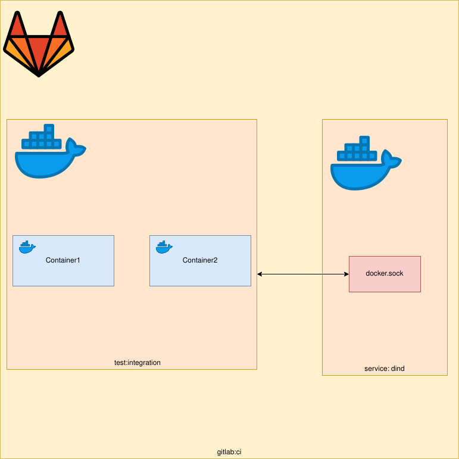

On a recent project, I was working on, I wanted to test my web service using docker-compose where I can run and kill
Docker containers used by the application and see how my web application reacts to that. In this article, we will
go over how you start docker containers using docker-compose from within Gitlab CI.



The diagram above is a visualisation of what we are trying to achieve. We want to spawn Docker containers using docker-compose
from within our job. The spawning and destruction of these Docker containers will be done via our Python code. We can achieve
this by using dind (Docker in Docker). I have written a previous article on this topic which you can read more about
[here](https://medium.com/@hmajid2301/dind-with-gitlab-ci-3d588ab9321d). This article assumes you already somewhat familiar
with Docker, docker-compose and Pytest.

## docker-compose.yml

This compose file will be used to start our Docker containers.

```yaml
version: "3"

services:
  service1:
    container_name: container1
    image: docker
    command: ["tail", "-f", "/dev/null"]

  service2:
    container_name: container2
    image: docker
    command: ["tail", "-f", "/dev/null"]
```

## .gitlab-ci.yml

Next, we have our `.gitlab-ci.yml` file, this file is used to tell Gitlab CI what our CI jobs should do.
In this example, we have one job called `test:integration` which will run our integration tests. But before we do that
we need a way to access the Docker daemon from within Gitlab CI, this can be done by using the `docker:dind` service.

The docker:dind image automatically using its entry point starts a docker daemon. We need to use this daemon to
start/stop our Docker images within CI. The docker:dind (dind = Docker in Docker) image is almost identical to
the docker image. The difference being the dind image starts a Docker daemon. In this example, the job will
use the docker image as the client and connect to the daemon running in this container.

```yaml
services:
  - docker:dind

tests:integration:
  stage: test
  image: hmajid2301/dind-docker-compose
  script:
    - pip install pytest lovely-pytest-docker
    - pytest -s tests/test_integration.py
```

The job itself is very simple, it uses a container which already comes with `docker` and `docker-compose`. Next we
install the dependencies we need for our tests. Then it runs our tests.

## test_integration.py

Now onto our actual tests file. It looks more complicated than it is:

```py
import docker as docker_py
import pytest

docker_client = docker_py.from_env()
docker_compose = None


@pytest.fixture(scope="session", autouse=True)
def docker(docker_services):
    global docker_compose
    docker_compose = docker_services


@pytest.fixture(scope="session", autouse=True)
def setup():
    docker_compose.start()
    yield
    docker_compose.shutdown()


def kill_container(container_name):
    container = get_container(container_name)
    container.kill()
    container.remove()


def get_container(container_name):
    containers = docker_client.containers.list()
    for container in containers:
        if container.name == container_name:
            return container


def start_container(service_name):
    docker_compose.start(service_name)


def test_two_containers():
    containers = docker_client.containers.list()
    assert len(containers) == 2


def test_kill_container1():
    kill_container("container1")
    containers = docker_client.containers.list()
    container1 = get_container("container1")
    assert len(containers) == 1
    assert not container1

def test_start_container1():
    start_container("service1")
    containers = docker_client.containers.list()
    container1 = get_container("container1")
    assert len(containers) == 2
    assert container11
```

The first part is the setup, we will use the python Docker library,`docker`. Which allow us to use Python code to
control our Docker daemon. The first `@pytest-fixture` called `docker` allows us to use the
`lovely-pytest-docker` library. To give us a `docker_compose` object which will allow us to again use Python code to
control our `docker-compose.yml` file (start-up/stop containers). The library also has some very nice features such
as waiting for containers or executing commands within containers. You can find the available functions
[here](https://github.com/lovelysystems/lovely-pytest-docker/blob/master/src/lovely/pytest/docker/compose.py).
Now we can access the `docker_compose` object by using our `docker_compose` global variable.

The reason we have both a library for Docker and docker-compose is because at the moment there is no way to use
`lovely-pytest-docker` (as far as I'm aware) to stop a single container. So we need to use the standard `docker`
library to do that. We also use the standard `docker` library to find out if a container is running.

Next, we have the `setup()` fixture which we auto use, this means the fixture is run before our test, normally a fixture
would only be called once it has been referred to within another function. In this function, we start both of our containers
in our `docker-compose` file. This is the same as running `docker-compose up --build -d`. Next we `yield`, how exactly the
`yield` command works I won't go over in this article, all you have to know is that everything after the yield will only
be run after all of our tests. In this case we teardown our containers (stop them). This is the same as running `docker-compose down`.

```py
import docker as docker_py
import pytest

docker_client = docker_py.from_env()
docker_compose = None


@pytest.fixture(scope="session", autouse=True)
def docker(docker_services):
    global docker_compose
    docker_compose = docker_services


@pytest.fixture(scope="session", autouse=True)
def setup():
    docker_compose.start()
    yield
    docker_compose.shutdown()
```

The next part of our file contains some helper functions I've written. These functions can be used by multiple tests.
This helps our tests file stay more DRY (do not repeat yourself). You may well want to make these part of a
(helper) class that you expose as a fixture. If you wanted to structure these properly so they can be accessed by
more than one file. Also whilst we are on this topic, we may want to move our fixture to `conftest.py`, again to allow
other files to use the same fixture we have defined here. But to keep this example simpler we will leave it here.

```py
def kill_container(container_name):
    container = get_container(container_name)
    container.kill()
    container.remove()


def get_container(container_name):
    containers = docker_client.containers.list()
    for container in containers:
        if container.name == container_name:
            return container


def start_container(service_name):
    docker_compose.start(service_name)
```

Finally, onto our actual tests, in reality, these tests are very boring and not super useful but they should give you an
idea what you can do. Such as killing the database container and then check how your Python application responds. Then
you can start the database container and again check how your Python application responds.
You can read more about how you can test Python Flask applications with pytest
[here](https://medium.com/@hmajid2301/testing-mocking-a-connexion-flask-application-with-pytest-bacfd07099eb).

So what do our tests do? Well, the first one checks the number of containers running is equal to 2.
The next one kills `container1` and checks that only one container is running and it's not `container1`.
Our final test starts `container1` and checks that it is running and the number of containers running
is back to 2. After this final test has completed then the `setup` fixture will run its `docker_compose.shutdown()`
command.

```py
def test_two_containers():
    containers = docker_client.containers.list()
    assert len(containers) == 2


def test_kill_container1():
    kill_container("container1")
    containers = docker_client.containers.list()
    container1 = get_container("container1")
    assert len(containers) == 1
    assert not container1

def test_start_container1():
    start_container("service")
    containers = docker_client.containers.list()
    container1 = get_container("container1")
    assert len(containers) == 2
    assert container1
```

That's it we've managed to start/stop Docker containers from within Gitlab CI, using DinD. In a future article I will
explain how you could run your tests within a Docker container you've started. Say you had three containers `nginx`, `flask`
and `postgres` and you wanted to run your tests within the `flask` container. But for now that's it, thanks for reading!

## Appendix

- [Source Code](https://github.com/hmajid2301/medium/tree/master/28.%20DinD%20Docker%20Testing/source_code)
