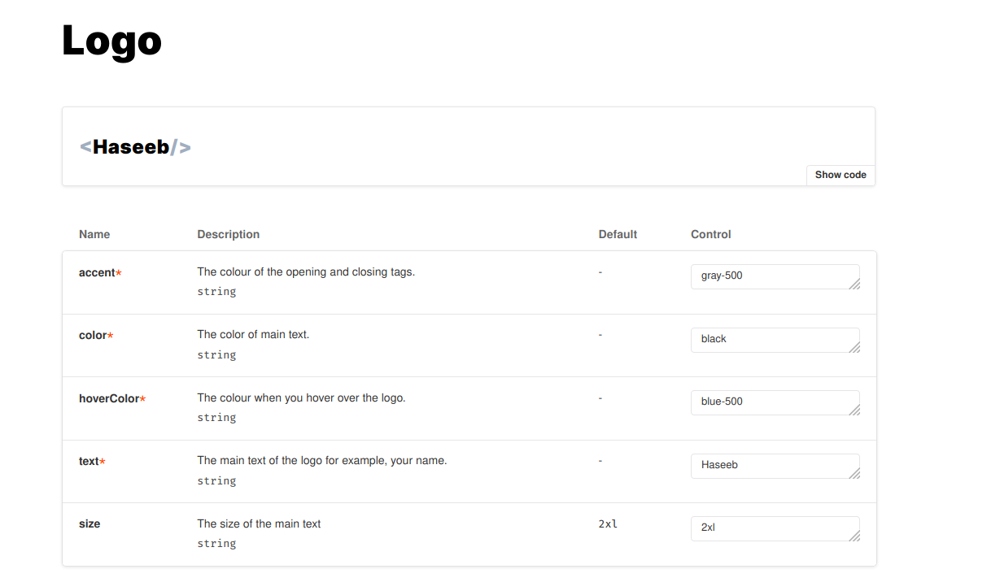
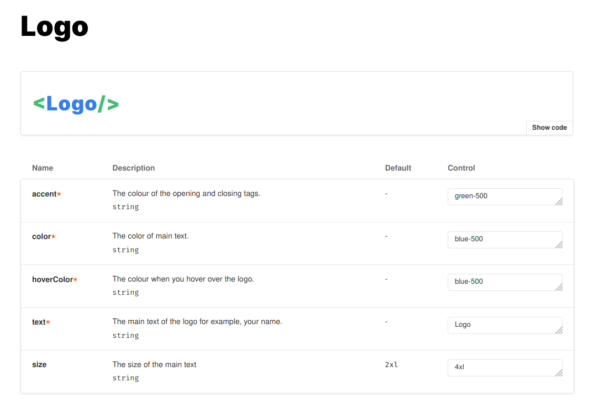
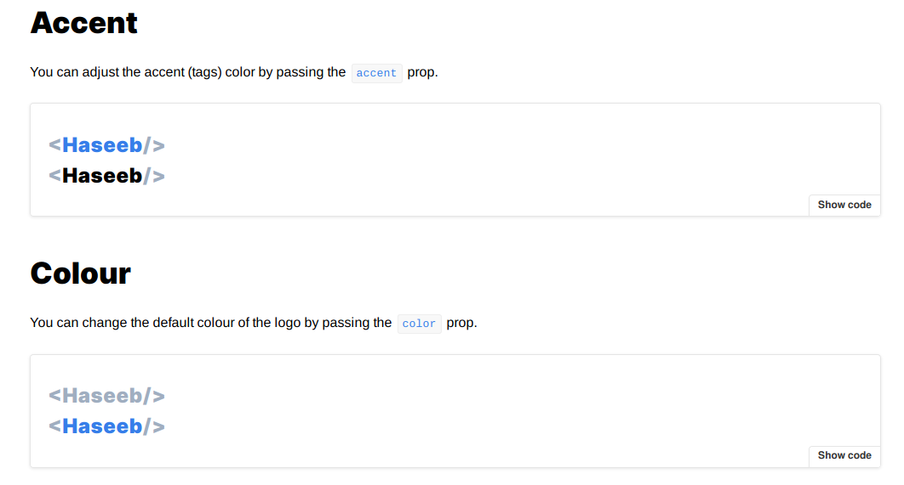
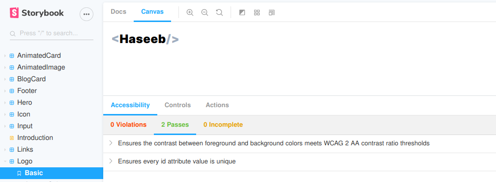

This article (sort of) continues on from my previous article
[How to use Storybooks, Gatsby, Babel, Tailwind, Typescript together](https://medium.com/@hmajid2301/how-to-use-storybooks-gatsby-babel-tailwind-typescript-together-801cb174a4d2).
In this article, we will document our React components using Storybook with MDX.

You can find an example project using this [here](https://gitlab.com/hmajid2301/personal-site/-/tree/e415420744b2a8f49eddaf2d3058b23c70f46638/.storybook),
you can also find a [demo site](https://storybook.haseebmajid.dev/) for said project.

## Prerequisite

Just to make sure everyone's on the same page let's follow the same steps to setup Storybook as we had in the last article.
We will use the latest versions of Storybook (v6) so we can access the latest features. We will go over how we can use
these features in the next article.

First, remove any lines in your `package.json` that start with `@storybook`. In my case,
I removed `@storybook/addon-actions`, `@storybook/add-links`, `@storybook/addons` and
`@storybook/react`. The typescript docgen modules will be used to parse our components and retrieve the props information
for Storybook. We will see a bit later with the control addon.

```bash
yarn add --dev @storybook/addon-docs@6.0.0-beta.20 @storybook/addon-essentials@6.0.0-beta.20 \
@storybook/addon-storysource@6.0.0-beta.20  @storybook/preset-typescript@1.2.0 \
@storybook/react@6.0.0-beta.20 core-js@2.6.5 react-docgen-typescript@1.16.5 \
react-docgen-typescript-loader@3.6.0

npx -p @storybook/cli sb init -f
vim .storybook/main.js
vim .storybook/preview.js
vim preview-head.html
vim webpack.config.js
```

Next, we will update the `main.js` file. This will tell Storybook where to look for the stories, in this case in the `src` folder
any file called `x.stories.mdx` or `x.stories.tsx`.

```js
// .storybook/main.js
module.exports = {
  stories: ["../src/**/*.stories.@(tsx|mdx)"],
  addons: ["@storybook/addon-essentials", "@storybook/preset-typescript"],
};
```

Next, let's update the preview file. Here you can define global parameters and decorators. Again
will see more of this in the next article.

```js
// .storybook/preview.js
import React from "react";

import { action } from "@storybook/addon-actions";
import { configure } from "@storybook/react";

import "../src/styles/globals.css";

configure(require.context("../src", true, /\.stories\.mdx$/), module);

global.___loader = {
  enqueue: () => {},
  hovering: () => {},
};
global.__PATH_PREFIX__ = "";
window.___navigate = (pathname) => {
  action("NavigateTo:")(pathname);
};
```

If we want to use any custom fonts, such as google fonts or other styles within our Tailwind, we need to
define them here.

```html
<!--  .storybook/preview-html.html  -->
<link
  href="https://fonts.googleapis.com/css2?family=Inter:wght@600,900&display=swap"
  rel="stylesheet"
/>
```

Storybook uses webpack, so if we want to add extra webpack options, we do that here. This allows us to use
things like Babel and PostCSS loader.

```js
// .storybook/webpack.config.js

module.exports = ({ config }) => {
  config.module.rules[0].use[0].loader = require.resolve("babel-loader");
  config.module.rules[0].use[0].options.presets = [
    require.resolve("@babel/preset-react"),
    require.resolve("@babel/preset-env"),
  ];

  config.module.rules.push({
    test: /\.(ts|tsx)$/,
    loader: require.resolve("babel-loader"),
    options: {
      presets: [["react-app", { flow: false, typescript: true }]],
      plugins: [],
    },
  });

  config.module.rules.push({
    test: /\.css$/,
    use: [
      {
        loader: "postcss-loader",
        options: {
          sourceMap: true,
          config: {
            path: "./.storybook/",
          },
        },
      },
    ],
  });

  return config;
};
```

## Add-ons

Let's install the extra add-ons we will use with storybooks:

- [a11y](https://github.com/storybookjs/storybook/tree/next/addons/a11y): Will list any accessibility issues with your component
- [controls](https://github.com/storybookjs/storybook/tree/next/addons/controls): Is the new version of the addon-knobs and will let you control the props you pass in
- [viewport](https://github.com/storybookjs/storybook/tree/next/addons/viewport): Allows you to test how your component looks, with different viewports like iPhone, 13" etc

```bash
yarn add --dev @storybook/addon-a11y@6.0.0-beta.20 @storybook/addon-controls@6.0.0-beta.15 \
                @storybook/addon-viewport@6.0.0-beta.20
```

Let's update the `.storybook/main.js` so that Storybook uses the new addons we've just installed.

```js
module.exports = {
  stories: ["../src/**/*.stories.@(tsx|mdx)"],
  addons: [
    "@storybook/addon-a11y",
    "@storybook/addon-controls",
    "@storybook/addon-essentials",
    "@storybook/preset-typescript",
    "@storybook/addon-viewport",
  ],
};
```

Next, let's update `.storybook/preview.js` so it looks like:

```js
import React from "react";

import { withA11y } from "@storybook/addon-a11y";
import { action } from "@storybook/addon-actions";
import { configure, addDecorator, addParameters } from "@storybook/react";
import { INITIAL_VIEWPORTS } from "@storybook/addon-viewport";

// We will address this later.
import "../src/styles/globals.css";
import "./main.css";

// automatically import all files ending in *.stories.js
configure(require.context("../src", true, /\.stories\.mdx$/), module);

// Gatsby Setup
// ============================================
// Gatsby's Link overrides:
// Gatsby defines a global called ___loader to prevent its method calls from creating console errors you override it here
global.___loader = {
  enqueue: () => {},
  hovering: () => {},
};
// Gatsby internal mocking to prevent unnecessary errors in storybook testing environment
global.__PATH_PREFIX__ = "";
// This is to utilized to override the window.___navigate method Gatsby defines and uses to report what path a Link would be taking us to if it wasn't inside a storybook
window.___navigate = (pathname) => {
  action("NavigateTo:")(pathname);
};

// Storybook Addons
// ============================================
addParameters({
  viewport: {
    viewports: INITIAL_VIEWPORTS,
    defaultViewport: "responsive",
  },
  options: {
    panelPosition: "right",
    storySort: (a, b) =>
      a[1].kind === b[1].kind
        ? 0
        : a[1].id.localeCompare(b[1].id, undefined, { numeric: true }),
  },
  inline: true,
});

// Storybook Decorators
// ============================================
addDecorator(withA11y);
```

The following snippet allows Storybook to show the default list of viewports. You can customise this list by following
[this README here](https://github.com/storybookjs/storybook/tree/next/addons/viewport).

```js
viewport: {
  viewports: INITIAL_VIEWPORTS,
  defaultViewport: "responsive",
}
```

This part of the `addParameters` sorts all of our storybook components in descending capital order (in the left panel).

```js
options: {
  panelPosition: "right",
  storySort: (a, b) =>
    a[1].kind === b[1].kind
      ? 0
      : a[1].id.localeCompare(b[1].id, undefined, { numeric: true }),
},
```

The final part will add a panel which will list accessibility (a11y) issues with our components, such as missing an
`alt` in an `` tag.

```js
addDecorator(withA11y);
```

## MDX

MDX is markdown mixed with JSX, it lets us render "React" code within markdown files, whilst providing all the features
of markdown as well as headers and hyperlinks. So I feel it is a perfect way to document your Storybooks.

### src/introduction.stories.mdx

This file is an example of a story which will not render any of our components. It's simply there for documentation. This
file will list the colour palette of the app. It will get the colours from our `tailwind.config.js` (mixed with the default one).
So if you changed the values in the tailwind config file, it'll also change them in this story.

```md
import {
Meta,
ColorPalette,
ColorItem,
Typeset,
} from "@storybook/addon-docs/blocks";

import { Themes } from "~/styles";
import { theme } from "~/utils/tailwindConfig";

<Meta title="Introduction" />

# Introduction

This project uses Tailwindcss so a lot of colour props are passed in as CSS classes that
Tailwind applies styling to i.e. `text-blue-500` to use the primary blue. You can find the
full colour palette [here](https://tailwindcss.com/docs/customizing-colors/#default-color-palette).

## Colours

### Light Theme

<ColorPalette>
  <ColorItem
    title="theme.color.background"
    subtitle="White"
    colors={[theme.colors.white]}
  />
....
</ColorPalette>

### Dark Theme

<ColorPalette>
  <ColorItem
    title="theme.color.background"
    subtitle="White"
    colors={[theme.colors.gray[900]]}
  />
....
</ColorPalette>

### Shared

<ColorPalette>
  <ColorItem
    title="theme.color.primary"
    subtitle="Blue"
    colors={[theme.colors.blue[500]]}
  />
  ....
  <ColorItem
    title="Monochrome"
    colors={[
      theme.colors.monochrome[900],
      theme.colors.monochrome[800],
      theme.colors.monochrome[700],
      theme.colors.monochrome[600],
      theme.colors.monochrome[500],
      theme.colors.monochrome[400],
      theme.colors.monochrome[300],
      theme.colors.monochrome[200],
      theme.colors.monochrome[100],
    ]}
  />
</ColorPalette>

## Typography

### Header

**Font**: Inter
**Weight**: 900

<Typeset fontFamily="Inter" fontSizes={[10, 20, 30, 40, 50]} fontWeight={900} />
```

The first part contains our imports so we can render the colours correctly. It also includes a meta tag where we list
the title of the page, each of our stories should have one of these meta tags.

```md
import {
Meta,
ColorPalette,
ColorItem,
Typeset,
} from "@storybook/addon-docs/blocks";

import { Themes } from "~/styles";
import { theme } from "~/utils/tailwindConfig";

<Meta title="Introduction" />
```

#### utils/tailwindConfig.js

We use this simple script to resolve the values of the tailwind config so we can use them like so
`theme.colors.orange[500]`. We pass the script our current config, it then combines it with the default config and
generates a final tailwind config. From this, we get the theme part as this is all we need to retrieve our colours.
So with a class name of say `text-blue-500` to get the colour, we would do `theme.colors.blue[500]`.

```js
import resolveConfig from "tailwindcss/resolveConfig";

import tailwindConfig from "../../tailwind.config";

const config = resolveConfig(tailwindConfig);
const { theme } = config;

export default config;
export { theme };
```

## Component

Now let's take a look at how to create a Storybook story for one of our components.

### src/components/Logo/Logo.tsx

Say we have a component that looks like:

```tsx
import React from "react";
import tw from "twin.macro";

export interface Props {
  /** The colour of the opening and closing tags. */
  accent?: string;
  /** The colour of main text. */
  color?: string;
  /** The colour when you hover over the logo. */
  hoverColor?: string;
  /** The main text of the logo for example, your name. */
  text: string;
  /** The size of the main text  */
  size?: "xs" | "sm" | "lg" | "xl" | "2xl" | "3xl" | "4xl";
}

const Logo = ({
  accent = "black",
  color = "black",
  hoverColor = "blue-500",
  text,
  size = "2xl",
}: Props) => (
  <LogoContainer
    className={`hover:text-${hoverColor} text-${color} lg:text-${size}
    md:text-xl sm:text-md text-sm`}
  >
    <Tag className={`text-${accent}`} data-testid="OpeningTag">
      &lt;
    </Tag>
    {text}
    <Tag className={`text-${accent}`} data-testid="ClosingTag">
      /&gt;
    </Tag>
  </LogoContainer>
);

const LogoContainer = tw.div`cursor-pointer font-header font-black tracking-wide `;

const Tag = tw.span``;

export default Logo;
```

Since we are using Typescript, we define our props as an interface. The comments above each item in the interface
will be parsed by docgen and shown in our story (we will see this a bit later). It will let the user know what
the prop is so they know how to adjust it. We will also see in a little bit.

```tsx
export interface Props {
  /** The colour of the opening and closing tags. */
  accent?: string;
  /** The colour of main text. */
  color?: string;
  /** The colour when you hover over the logo. */
  hoverColor?: string;
  /** The main text of the logo for example, your name. */
  text: string;
  /** The size of the main text  */
  size?: "xs" | "sm" | "lg" | "xl" | "2xl" | "3xl" | "4xl";
}
```

The rest of the file is a normal React component, nothing special here. So how do we document this with Storybooks UI?

### src/components/Logo/Logo.stories.mdx

So now onto the real meat and potatoes of this article, let's document a React component. So I think one of the coolest
parts of the new Storybook is the controls add-on we installed earlier. So how we do this is to provide the props as
`args` object. Then we pass this onto the component give a name called `Basic` below.

```md
import { Meta, Story, Preview, Props } from "@storybook/addon-docs/blocks";

import { theme } from "~/styles";
import Logo from "./Logo";

<Meta title="Logo" component={Logo} />

# Logo

<Preview>
  <Story
    name="Basic"
    args={{
      accent: "gray-500",
      color: "black",
      hoverColor: "blue-500",
      text: "Haseeb",
    }}
  >
    {(args) => <Logo {...args} />}
  </Story>
</Preview>

<Props story="Basic" />
```

In the diagram below is the `docs` tab in Storybook (default is the `canvas` tab). As you can see in the diagrams
below we have a table which is taken from the props in our Logo component. We also have the comments shown as
descriptions, any default values we assigned and the current value. Which we set above in the stories file
`Logo.stories.mdx`. We can then edit the values within the controls table, it will automatically re-render our
component on the fly. You can see this in the second image.





Then we can define our regular stories components like so:

```md
## Accent

You can adjust the accent (tags) color by passing the `accent` prop.

<Preview>
  <Story name="Accent Colour">
    <div>
      <Logo
        accent="gray-500"
        color="blue-500"
        text="Haseeb"
        hoverColor="blue-500"
      />
      <Logo
        accent="gray-500"
        color="black"
        text="Haseeb"
        hoverColor="blue-500"
      />
    </div>
  </Story>
</Preview>

## Colour

You can change the default colour of the logo by passing the `color` prop.

<Preview>
  <Story name="Main Text Colour">
    <div>
      <Logo
        accent="gray-500"
        color="gray-500"
        text="Haseeb"
        hoverColor="blue-500"
      />
      <Logo
        accent="gray-500"
        color="blue-500"
        text="Haseeb"
        hoverColor="blue-500"
      />
    </div>
  </Story>
</Preview>
```

The example above will be rendered into something shown in the image below. You can see from this example we are now
mixing our React component with our normal markdown syntax. This provides a very flexible way to document our components.
It allows others to interact with and look at an example of its use.



That's about it documentation wise! Taking a look at the other features we added you can see the a11y issues in a panel
(either on the bottom or on the right of when you are in the `canvas` tab). You can see this in the diagram below.



Then at the top of the screen, we just adjust the viewport and see how our component would look at different resolutions.
The default list we have includes resolutions for devices like various iPhones, Google Pixel and Galaxy Sx. You can
see this in the diagram below.


## Run

We can run the Storybook UI from our source code like so:

```bash
git clone https://gitlab.com/hmajid2301/articles.git
cd articles/30.\ Storybooks,\ Gatsby\ and\ MDX\ II/source_code/
yarn
yarn storybook
```

With all of this setup now we can focus on a component first approach I like to use atomic design alongside Storybooks UI.
To create all of the components of my website before I start work on the pages themselves. This allows me to work out exactly
what each page will need, break them down into its core parts and work on them one at a time. Anyways that's it, thanks
for reading!

## Appendix

- [Source Code](https://gitlab.com/hmajid2301/medium/tree/master/30.%20Storybooks,%20Gatsby%20and%20MDX%20II/source_code)
- [Example Project](https://gitlab.com/hmajid2301/personal-site/-/tree/e415420744b2a8f49eddaf2d3058b23c70f46638/.storybook)
- [Example Storybook](https://storybook.haseebmajid.dev/)
