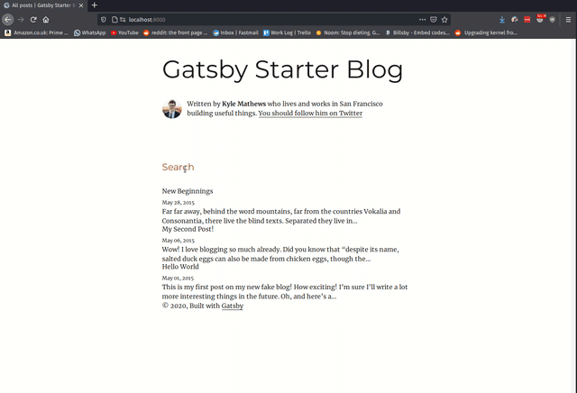

Let's take a look at how we can add offline local search 🔍 to a Gatsby blog. There are two main types of search we can
use an offline search like `elasticlunr` and external API search engines like `ElasticSearch`. These are typically more
scalable but also more expensive.

> You can find more info [here](https://www.gatsbyjs.com/docs/adding-search/#reach-skip-nav).

In this article, I will show you how to add offline search to your Gatsby blog using `elasticlunr`. This means your
website needs to be indexed locally and will increase the bundle size as this index needs to be loaded by the client but
with the scale and size of personal blogs (100s, not 1000s of blog post) this shouldn't make a massive difference.
We will also look at how we can add highlighting to our search results.

> Note that you need to be careful with offline search because the entire search index has to be brought into the client, which can affect the bundle size significantly - GatsbyJS

## Setup

Before we add search Gatsby blog, let's setup a simple Gatsby site using the `Gatsby blog starter`, you can of course
skip this step and add search to an existing site.

```bash
npm -g install gatsby-cli
gatsby new my-blog-starter https://github.com/gatsbyjs/gatsby-starter-blog
```

## Markdown

The search component will use the data within our markdown and index it, so that the client can search with this
data later. In this example I will assume your markdown files look something like the example below:

```md:title=content/blog/hello-world/index.md
---
title: Hello World
date: "2015-05-01"
tags: ["food", "duck"]
---

This is my first post on my new fake blog! How exciting!

I'm sure I'll write a lot more interesting things in the future.

...
```

The top part of a markdown file between the `---` is known as the front matter, often we can access this data as a
key/value (like a Python dictionary).

> Note: In this example, we will be using the [`MarkdownRemark`](https://www.gatsbyjs.com/plugins/gatsby-transformer-remark/?=markdown), but you can use search for anything just adjust the examples below as required.

## Search

Now onto adding search to our site.

### Elasticlunr

We will use `elasticlunr` for our offline/local search. Luckily there is a Gatsby plugin we can use, which makes
integrating it into our site very easy. First install the following plugin and the library:
`yarn add @gatsby-contrib/gatsby-plugin-elasticlunr-search elasticlunr`.

Then open your `gatsby-config.js` and add the following:

```js:title=gatsby-config.js
{
    resolve: `@gatsby-contrib/gatsby-plugin-elasticlunr-search`,
    options: {
      fields: [`title`, `tags`],
      resolvers: {
        MarkdownRemark: {
          title: (node) => node.frontmatter.title,
          tags: (node) => node.frontmatter.tags,
          path: (node) => node.frontmatter.slug,
        },
      },
    },
  },
```

Here we are telling the search plugin what (GraphQL) fields to index. In this example, we want to index
the title and tags. We could also index the content if we wanted by adding the following line after path
`html: (node) => node.internal.content,` and adding `html` to the `fields` array. You can index
any field available in GraphQL, provided by the `MarkdownRemark` plugin (or whichever plugin you are using).

#### GraphQL (Optional)

Slight aside here but if you wish to explore and take a look at the data available/provided by the `MarkdownRemark` plugin, you can start your
Gatsby site, typically using `yarn develop` and once the command has finished doing it's magic 🎉, visit this page
`http://localhost:8000/___graphql`. This provides us with our GraphQL playground (an IDE) and is a great way to understand what is going
on with our GraphQL queries if you don't understand.

For example, if you type the following into the main field and press the play button at the top.

```graphql
query MyQuery {
  allMarkdownRemark(
    sort: { order: DESC, fields: [frontmatter___date] }
    filter: { frontmatter: { title: { ne: "Uses" } } }
  ) {
    edges {
      node {
        id
        excerpt(pruneLength: 100)
        frontmatter {
          date(formatString: "YYYY-MM-DD")
          title
          tags
        }
      }
    }
  }
}
```

You should see something like (in this example):

```json
{
  "data": {
    "allMarkdownRemark": {
      "edges": [
        {
          "node": {
            "id": "1a7e02d4-620a-5268-8149-2d8cbf26a20a",
            "excerpt": "Far far away, behind the word mountains, far from the countries Vokalia and\nConsonantia, there live…",
            "frontmatter": {
              "date": "2015-05-28",
              "title": "New Beginnings",
              "tags": ["deer", "horse"]
            }
          }
        },
        {
          "node": {
            "id": "fe83f167-8f86-51fe-a981-c5189625e270",
            "excerpt": "Wow! I love blogging so much already. Did you know that “despite its name, salted duck eggs can also…",
            "frontmatter": {
              "date": "2015-05-06",
              "title": "My Second Post!",
              "tags": ["food", "blog"]
            }
          }
        },
        {
          "node": {
            "id": "4e865c18-e797-5da8-a46d-902949a00c7f",
            "excerpt": "This is my first post on my new fake blog! How exciting! I’m sure I’ll write a lot more interesting…",
            "frontmatter": {
              "date": "2015-05-01",
              "title": "Hello World",
              "tags": ["food", "duck"]
            }
          }
        }
      ]
    }
  },
  "extensions": {}
}
```

As you can see this is a very familiar structure to the one we described in our search config above. If you play
around with the fields on the left-hand side of the IDE, you should be able to get a better understanding of all
fields you can index.

## Logic

Now we will add the relevant JSX components we need for search to our site.

### TailwindCSS (Optional)

You can follow this [tutorial](https://www.gatsbyjs.com/docs/tailwind-css/) to add TailwindCSS.
We will add TailwindCSS to this Gatsby project and we will use this to style our components.
First install the following dependencies:

```bash
yarn add tailwindcss gatsby-plugin-postcss @emotion/core @emotion/styled gatsby-plugin-emotion
yarn add -D twin.macro # twin.macro allows us to use css-in-js a bit like emotion/styled-components except for tailwind
npx tailwindcss init
```

Then add the following to your `gatsby-config.js`:

```js:title=gatsby-config.js
plugins: [`gatsby-plugin-postcss`, `gatsby-plugin-emotion`],
```

Then create a new file:

```bash
vim main.css
#...

# Contents of the file
@tailwind base;
@tailwind components;
@tailwind utilities;

# ...
```

Then add the following line to `gatsby-browser.js`:

```js:title=gatsby-browser.js
import "./src/main.css";
```

Finally create a new file `postcss.config.js` and add the following:

```js:title=postcss.config.js
module.exports = () => ({
  plugins: [require("tailwindcss")],
});
```

### Components

We will create all of the components in the following `src/components` folder.
First, let's create the `Input.jsx` component for the text input, which looks something like this:

```jsx:title=Input.jsx file=./source_code/src/components/Input.jsx

```

Since we are using `twin.macro` we can use syntax like ` const TextInput = tw.input`` `. Hence we can use the name `TextInput`.
in our component, where `TextInput` is just an input with some tailwindcss styles we've defined.

Note we added a React forward ref so that, we can autofocus on this input later on.
So when the input is shown to the client we are already focused into the input.

Next, let's create a component for `SearchItem.jsx`. This is a single search item found.
In this case, we will only show the title and read more button. Note we are using the
`react-highlight-words` library to highlight words from the search query.

The prop `query` is the search query the user typed in. In the `Highlighter` component the `searchWords` prop
is given a list of words to highlight, hence we need to split the string into an array. For example, if we
had the search query `"A blog post"`, it would become `["A", "blog", "post"]`, and will highlight either of
those words in the title (A, blog or post).

> Note: Again you can extend this to include perhaps a description of the blog post (first 160 characters) etc. We are just keeping it simple for this example.

```jsx:title=src/components/SearchItem.jsx file=./source_code/src/components/SearchItem.jsx

```

Next, we have a component we will call `SearchItems.jsx`, which will be a list of the search results and look
something like:

```jsx:title=src/components/SearchItems.jsx file=./source_code/src/components/SearchItems.jsx

```

Now onto the main component, the component that will actually work out the results to show
to the client. We will call this component `Search.jsx`:

```jsx:title=src/components/Search.jsx file=./source_code/src/components/Search.jsx

```

Let's break this down:

```jsx:title=src/components/Search.jsx
const index = Index.load(searchIndex);
const [query, setQuery] = useState("");
const [results, setResults] = useState([]);
const searchInput = React.createRef();
```

The first part will be used to store some variables we need later on. Like storing the current query the client has
typed into the search, the current search results and a reference to the search input so we can focus into it.

```jsx:title=src/components/Search.jsx
useEffect(() => {
  searchResults("blog");
  searchInput.current.focus();
}, []);
```

Next, the `useEffect` hook is called as soon as the component mounts, so as soon as the component mounts we will focus
into the `searchInput` component `searchInput.current.focus()` and we pre-fill the search with any blog post with
`"blog"` in it's title/tags `searchResults("blog")`.

```jsx:title=src/components/Search.jsx
function searchResults(searchQuery) {
  const res = index.search(searchQuery, { expand: true }).map(({ ref }) => {
    return index.documentStore.getDoc(ref);
  });
  setResults(res);
}
```

This is the actual function which gets our search results. It makes the query with `elasticlunr` and
stores the results in out state hook variable `result` using the set function `setResults(res)`. The first part
of the function does most of the heavy lifting returning a list of possible results to show to the client.

```jsx:title=src/components/Search.jsx
<Input
  ref={searchInput}
  className="px-2"
  label="Search"
  onChange={(e) => {
    const searchQuery = event.target.value;
    setQuery(searchQuery);
    searchResults(searchQuery);
  }}
  placeholder="Search"
  value={query}
/>
```

> Note: `e.target.query` is the current value in the text input.

Finally when taking a look at the input you can see the `ref={searchInput}` we defined above
being assigned here, so we can focus on this component. Next on any change i.e. a keypress we call the `onChange`
function. Where we update the query with the new search query `setQuery(searchQuery)` again using a state hook.
Then we call the `searchResults(searchQuery)` function which will update the results.

This is then shown to the client using our SearchItems component defined above like so:
`<SearchItems query={query} results={results} />`.

Finally, we have a "`SearchBar.tsx`", this is the component we will use to tie everything together.

```jsx:title=src/components/SearchBar.jsx file=./source_code/src/components/SearchBar.jsx

```

Normally I would use a search icon which when pressed would show the search overlay. However to keep things simple we
will just use the text "Search", which when clicked on will show our search overlay to the client.

```jsx:title=src/components/SearchBar.jsx
<h1
  className="hover:cursor-pointer text-orange-800 text-2xl my-10"
  onClick={() => setShowSearch(!showSearch)}
>
  Search
</h1>
```

The main job of this component is to toggle the search on/off. To do this we use a state hook like so:

```jsx:title=src/components/SearchBar.jsx
const [showSearch, setShowSearch] = useState(false);

function hideSearch(event) {
  if (event.target.placeholder !== "Search") {
    setShowSearch(false);
  }
}
```

Where we have a function to hide the search if the user clicks anything outside of the search. Hence the if statement
`event.target.placeholder`.

```jsx:title=src/components/SearchBar.jsx
<StaticQuery
  query={graphql`
    query SearchIndexQuery {
      siteSearchIndex {
        index
      }
    }
  `}
  render={(data) => (
    <SearchContainer>
      {showSearch && <Search searchIndex={data.siteSearchIndex.index} />}
    </SearchContainer>
  )}
/>
```

The next interesting part is the Graphql query to get the search index from `elasticlunr`. We this pass as `searchIndex`
prop to our `Search` component we created above. This is the same search index we search against the current user
query. We also use conditional rendering we only show the `Search` component when `showSearch` is true.

And that's it! We successfully added search to our `Gatsby` blog alongside search highlighting. Thanks for reading.

## Appendix

- [Source Code](https://gitlab.com/hmajid2301/articles/tree/master/32.%20Gatsby,%20and%20search/source_code)
- [Example Project](https://gitlab.com/hmajid2301/personal-site/-/blob/d5f413310d4404fc6a1761a592f5e10840fc30df/src/components/organisms/SearchBar/SearchBar.tsx)
- [Cover Photo by Markus Winkler](https://unsplash.com/@markuswinkler?utm_source=unsplash&utm_medium=referral&utm_content=creditCopyText)
