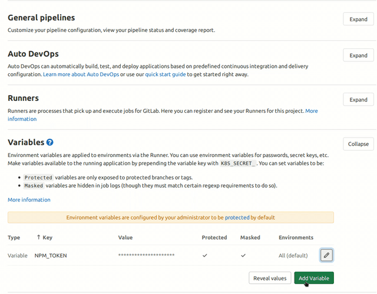

In this article, we will go over how we can use the `gitlab-auto-mr` CLI script I wrote to help automate your Gitlab
workflow. This is a very simple script you can use with Gitlab which will auto-create merge requests (MRs) every time you
create a new branch on a project in Gitlab.

## (Optional) Git Feature Branches

> Feel free to skip this section if you are already familar with feature branch, skip to the `Gitlab Auto MR` section

Before I introduce what the script does and how we use it, let's go over why you might need to use it.
Say you're working on a project with multiple other people and you want to make sure you keep your master/production
branch clean. One way to do that is everyone uses "feature" branches. So for every feature being added to the project
you create a new short-lived branch off of the master branch. Then typically one developer will work on a feature
and make a merge request when ready to get the branch merged into the main master branch, to integrate their work
with everyone else's.


This means your changes can get reviewed before they merged into the master branch. This helps keep the master branch
"cleaner", it should have fewer bugs etc. One good way to visualise this is in the diagram above. Let's say we want
to add reaction buttons to a blog. We would create a new branch called something like `feature/add-reaction-buttons`.
Then we would commit our changes on the branch.

Usually, this is coupled with a CI pipeline which will auto-run against our code. It may run jobs like unit tests, linting
and static code analysis. This acts as a kind of first step review, we need to make sure it's passing (and is green) before
people even start to review our code, as seen in the above diagram. Once the CI pipeline is working the merge request can
be reviewed. After the merge request has been approved it can be merged into the master branch and we will add the new
feature to our codebase, which will eventually get deployed to production. We can also then delete our old branch.
You can read more about [feature branches here](https://www.atlassian.com/git/tutorials/comparing-workflows/feature-branch-workflow).

> Note there are many other git flows. This can project can be used in conjunction with all which will use some form of feature branching.

### CI/CD

> Feel free to skip this section if you are already familiar with CI/CD, Git and Gitlab CI.

Continuous Integration (CI) is typically defined as making sure all code being integrated into codebase works.
It usually involves running a set of jobs referred to as a CI pipeline. Some jobs we may run include linting our
code and running unit tests. This is usually done automatically using a tool such as Travis, Circle or even Gitlab.

One use case for this is when others are adding new features to our codebase and we want to check it
still works. We can create a CI pipeline that will run unit tests against the new code automatically when a pull request
(GitHub) or merge request (Gitlab) is opened. This saves us a lot of time, rather than having to copy the new
features/code and then run the tests ourselves on our machine.

Continuous Delivery (CD) is typically an extension of CI to make sure that you can release new changes quickly.
This means automating your release process, such that you can deploy your application at any point of time just
by clicking on a button.

Continuous Deployment takes CD one step further by requiring no human intervention in deploying our application.
You can read more about [this here](https://www.atlassian.com/continuous-delivery/principles/continuous-integration-vs-delivery-vs-deployment)

## Gitlab Auto MR

I created a simple CLI script, that I run during on Gitlab CI, which will auto-create merge requests every time you create a new branch.
So you could have something like this:

```yml:title=.gitlab-ci.yml
stages:
  - pre

create:merge-request:
  image: registry.gitlab.com/gitlab-automation-toolkit/gitlab-auto-mr
  stage: pre
  except:
    - master
    - tags
  script:
    - gitlab_auto_mr -t master -c WIP -d .gitlab/merge_request_templates/merge_request.md -r -s --use-issue-name
```

To use this tool you will need to create a personal access token so that the tool can access the GitLab API on your behalf.
You can find out how to do that [here](https://docs.gitlab.com/ee/user/profile/personal_access_tokens.html). In the
the example above I have set the private token in my CI/CD variables as `GITLAB_PRIVATE_TOKEN` but you can also pass in the
`--private-token` argument instead.



If you use `registry.gitlab.com/gitlab-automation-toolkit/gitlab-auto-mr` this Docker image, the cli tool already
comes preinstalled with all of the dependencies as well. Else you can also install it manually using
`pip install gitlab-auto-mr`.

This particular job will only be run on a branch that is not called a master. This is because of the `except` clause
we defined above. Hence it should only run when we create a new feature branch. It will create a new merge request
if one does not already exist between this new branch and the master branch. The target branch it will create the
merge request to is set by the `-t` option, in this example `-t master`. For example, source branch -> target branch.

Next, we append all of our new merge requests with WIP, set by the `-c WIP` argument, where WIP typically means
`Work in progress` so other devs know not to review our MR as it's not ready. Next, the tool also allows you to
specify a merge request template to use by passing the `-d` and giving it the path to a file. In this example
`.gitlab/merge_request_templates/merge_request.md` looks like this:

```md:title=.gitlab/merge_request_templates/merge_request.md
# Description

<!-- please include a summary of the change and which issue is fixed. Please also include relevant motivation and context. List any dependencies that are required for this change. -->

## Type

- [ ] Bug Fix
- [ ] Improvement
- [ ] New Feature

Fixes #<!-- Issue Number -->
```

The final few options do the following:

- `-r`: Will remove the source branch (our feature branch) after the MR has been approved
- `-s`: Will squash our commits into a single commit, so each feature branch will appear as a single commit onto the master branch
- `--use-issue-name`: If set and you do something like `feature/#6` it will search for the issue with id `6` and pull information from there like labels and milestones etc. It will then assign those to this MR, an example of this can be seen with [MR here](https://gitlab.com/hmajid2301/stegappasaurus/-/merge_requests/196) where the issue [`#211` is here](https://gitlab.com/hmajid2301/stegappasaurus/-/issues/211)

You can get a full list of options available using this tool
[here at its project page](https://gitlab.com/gitlab-automation-toolkit/gitlab-auto-mr).

## Appendix

- This project was originally inspired by [this other project](https://gitlab.com/tmaier/gitlab-auto-merge-request) and this [post](https://rpadovani.com/open-mr-gitlab-ci)
- [Project Page](https://gitlab.com/gitlab-automation-toolkit/gitlab-auto-mr)
- [An example project](https://gitlab.com/hmajid2301/stegappasaurus/-/blob/84d48e80d77a04870b748d2ac62e2cb698f17db8/.gitlab-ci.yml)
- [Example MRs created with this tool](https://gitlab.com/hmajid2301/stegappasaurus/-/merge_requests/176)
- [Example pipeline running this tool](https://gitlab.com/hmajid2301/stegappasaurus/-/pipelines/120105476)
