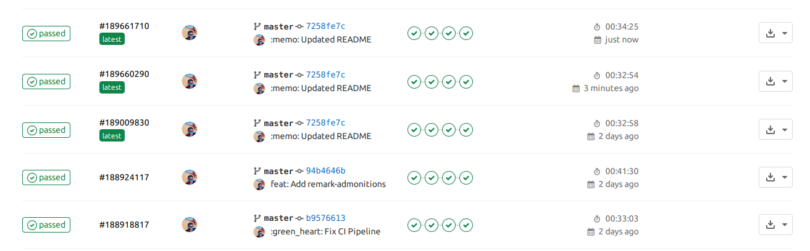

In this article, we will go over how you can manage your markdown blog posts from another git repository (repo). Separate to the git repository for your Gatsby site.
This is the same process that I use to manage [this repo](https://gitlab.com/hmajid2301/articles).

So what this entails is the source code for my Gatsby site is in a repo called `portfolio-site` on Gitlab.
Then I have another repo for all of the blog posts (in markdown) called `articles`. During build time of the
Gatsby blog, we will import the markdown files from our `articles` git repo and use it as a source of data for
our Gatsby blog.

## Git Plugin

First, install the [Gatsby git plugin](https://www.gatsbyjs.com/plugins/gatsby-source-git/?=git), so that we can source our data from git.

```bash
yarn add gatsby-source-git
```

Then add the plugin to your `gatsby-config.js` to tell it where to source its data from.

:::warning Gatsby Filesystem
You need to use the `gatsby-source-filesystem` before the `gatsby-source-git`.
You can read more about it [here at this Github issue](https://github.com/stevetweeddale/gatsby-source-git/issues/22).
:::

```js:title=gatsby-config.js
{
  resolve: `gatsby-source-git`,
  options: {
    name: `Articles`,
    remote: "https://gitlab.com/hmajid2301/articles.git",
    branch: `master`,
    patterns: ["**/*", "!**/*/index.md"],
  },
},
```

In our example, I will use [this](https://gitlab.com/hmajid2301/articles), the same repo this blog post originates from.
You can specify the branch to use if you want. The most interesting bit is the `patterns` section. This is where you can
specify which files to include and which to ignore `["**/*", "!**/*/index.md"]`. In this example, I want to ignore
all files called `index.md` because these are the ones that I use in my example Gatsby blogs in this repo for.
You can read more about the [pattern here](https://github.com/mrmlnc/fast-glob).

## GraphQL

We can now check if the articles are being imported correctly by using the GraphQL IDE that comes with Gatsby.

```bash
yarn develop

# Go to localhost:8000/__graphql
```

Then run the following query.

```graphql
query MyQuery {
  allMarkdownRemark {
    edges {
      node {
        fileAbsolutePath
      }
    }
  }
}
```

You should see output like this, where it will list all of your blog posts/markdown files. Here you can verify your git
repo is being sourced correctly.

```json
{
  "data": {
    "allMarkdownRemark": {
      "edges": [
        {
          "node": {
            "fileAbsolutePath": "/home/haseeb/projects/personal/articles/35. Gatsby source git/source_code/.cache/gatsby-source-git/Articles/1. Expo with VirtualBox and Genymotion/README.md"
          }
        },
        {
          "node": {
            "fileAbsolutePath": "/home/haseeb/projects/personal/articles/35. Gatsby source git/source_code/.cache/gatsby-source-git/Articles/11. React Navigation with React Native/README.md"
          }
        },
        {
          "node": {
            "fileAbsolutePath": "/home/haseeb/projects/personal/articles/35. Gatsby source git/source_code/.cache/gatsby-source-git/Articles/13. REST API using OpenAPI, Flask & Connexions/README.md"
          }
        }
        // ...
      ]
    }
  }
}
```

## Gatsby Node

Now make sure you have logic in your `gatsby-node.js` file to create a blog post page for every
markdown file that we source, i.e. one blog post for every item in the list above.

```js:title=gatsby-node.js
exports.createPages = async ({ graphql, actions }) => {
  const { createPage } = actions;

  const blogPost = path.resolve(`./src/templates/blog-post.js`);
  const result = await graphql(
    `
      {
        allMarkdownRemark(
          sort: { fields: [frontmatter___date], order: DESC }
          limit: 1000
        ) {
          edges {
            node {
              frontmatter {
                title
                slug
              }
            }
          }
        }
      }
    `
  );

  if (result.errors) {
    throw result.errors;
  }

  // Create blog posts pages.
  const posts = result.data.allMarkdownRemark.edges;

  posts.forEach((post, index) => {
    const previous = index === posts.length - 1 ? null : posts[index + 1].node;
    const next = index === 0 ? null : posts[index - 1].node;

    createPage({
      path: post.node.frontmatter.slug,
      component: blogPost,
      context: {
        slug: post.node.frontmatter.slug,
        previous,
        next,
      },
    });
  });
};
```

## Gitlab CI

So every time we make a change in our article repo we want to trigger a rebuild of our site. Since I use Gitlab, I will
show you how you can do this with Gitlab CI. Every commit on the master branch, on our repo that contains our
articles, will trigger a rebuild on the Gatsby repo.

:::caution Assumption
This next section assumes that you use Gitlab to host your repos.
It also assumes that for your Gatsby blog you use Gitlab CI to build/publish it.
:::

For example, in my use case [the article repo](https://gitlab.com/hmajid2301/articles) will trigger a rebuild for
[the Gatsby repo](https://gitlab.com/hmajid2301/portfolio-site/-/tree/7258fe7ca1366024f17da5952077cdc00f00a3a8).

First, go to your Gatsby repo then go to `Settings > CI/CD > Pipeline triggers`. Then create a new pipeline trigger,
save the newly created token to your CI/CD variables.

`youtube: JbAk6xpBRxc`
`youtube: X9m8UxmZgy8`

Then also copy the `cURL` command shown and add the following to your `.gitlab-ci.yml`, with the `cURL` command.

```yml{10}:title=.gitlab-ci.yml
stages:
  - build

rebuild:portfolio-site:
  stage: build
  image: curlimages/curl
  only:
    - master
  script:
    - "curl -X POST -F token=${TRIGGER_TOKEN} -F ref=master https://gitlab.com/api/v4/projects/19260161/trigger/pipeline"
```

Make sure you replace `19260161` with the project ID of your Gatsby blog, as this is the repo we want to trigger a
rebuild of. This means every time we push a new commit (i.e. an article) to the master branch of the articles,
it will trigger the pipeline to run on our Gatsby blog.

This will mean when it runs `yarn build` or `gatsby build` it'll source the markdown data from the latest commit on
our article git repo and will have the new article or whatever changes were made. The `.gitlab-ci` for our
Gatsby blog may look something like this:

```yml{29-30}:title=.gitlab-ci.yml
image: node:12.13.0
cache:
  key: ${CI_COMMIT_REF_SLUG}
  paths:
    - node_modules

stages:
  - build
  - deploy

before_script:
  - yarn install

build:site:
  stage: build
  only:
    - master
  script:
    - yarn run build
  artifacts:
    paths:
      - public

deploy:site:
  stage: deploy
  only:
    - master
  script:
    - npm i -g netlify-cli
    - yarn deploy --site $NETLIFY_SITE_ID --auth $NETLIFY_PERSONAL_TOKEN --message "$CI_COMMIT_TITLE"
  dependencies:
    - build:site
```

:::tip Artifacts
The `deploy:site` job uses the build artifacts from the previous `build:site` job which has the site data stored in the `public`
folder. Due to the sites default settings on Netlify, this is what is uploaded when we use `netlify-cli`.
:::

I build and deploy the site from Gitlab CI to save the build minutes on Netlify. All you need to do this is to get your
`NETLIFY_SITE_ID` and create a `NETLIFY_PERSONAL_TOKEN` that can make the API request to publish the site on your behalf.



:::important Gitlab CI
You can, of course, change the `deploy:site` job to suit how you want to deploy your site, i.e. Gitlab pages, Github Pages, Vercel etc.
:::

## Netlify

If you don't want to use Gitlab CI to build and publish your Gatsby blog and want to force a rebuild on Netlify.
Then you can do the following; Every time we push a new commit to the master branch on the article repo. We can
use a webhook to trigger a rebuild of our site on Netlify. To do this select your website on the Netlify GUI.
Then `Settings` > `Build & deploy` > `Build hooks`. Add a new build hook. Then copy the `cURL` command,
so your article repo `.gitlab-ci.yml` now looks something like:

```yml{10}:title=.gitlab-ci.yml
stages:
  - build

rebuild:portfolio-site:
  stage: build
  image: curlimages/curl
  only:
    - master
  script:
    - curl -X POST -d {} https://api.netlify.com/build_hooks/5f5e9c4f495aebe573c39aef
```

You will want to turn `5f5e9c4f495aebe573c39aef` into a CI/CD variable, else anyone can force a rebuild of your site.

`youtube: 7KRihyulbTQ`

That's it, we learnt how we can manage our markdown articles in a separate repo to our Gatsby blog! We went over how we
can also automate the rebuild of our site using Gitlab CI and Netlify.

## Appendix

- [Source Code](https://gitlab.com/hmajid2301/articles/tree/master/35.%20Gatsby%20source%20git/source_code)
- Example [Gatsby blog](https://gitlab.com/hmajid2301/portfolio-site/-/tree/7258fe7ca1366024f17da5952077cdc00f00a3a8) repo
- Example [Articles](https://gitlab.com/hmajid2301/articles) repo
