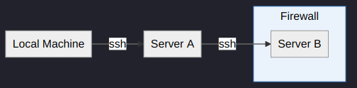
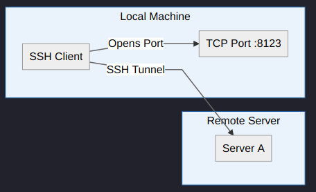
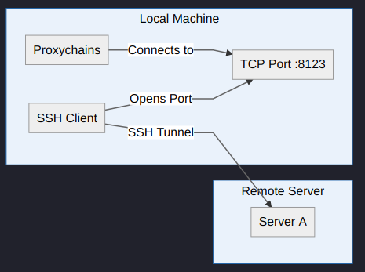
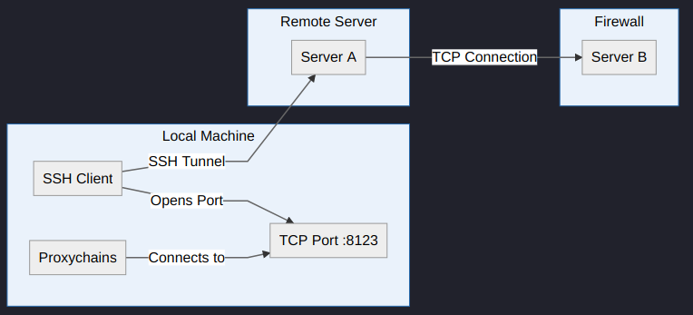

In this article, we will go over how you use `proxychains` to proxy our traffic through a socks proxy.

## Background

Recently like everyone else, I've been working from home a lot more often. This means to access resources at work
I need to use a VPN. However, to access some resources, such as production servers from my local machine, I need to
use a SOCKS5 proxy. Without using a SOCKS proxy, I would need to do something shown in the diagram below.

### Example Setup



First, I would need to SSH onto an intermediate server (`Server A`), which I have connectivity to from my local machine.
Then on that intermediate server, I would need to SSH onto the production server. So this intermediate server needs
to have connectivity to the `Server B` as well. As you can see `Server B` is behind a firewall, in this example, the
firewall will only allow traffic from `Server A` to ingress to `Server B`. So we cannot connect directly from `Server A`.

Another reason this setup is sub-optimal I lose all the development tools on my local machine. Say I wanted
to use terraform to deploy/upgrade a service running on `Server B` server. I need to make sure terraform exists
on the intermediate server. Now, this is fine for something simple like terraform which is a single binary file
but may get more complicated for other pieces of software, especially if you cannot install extra packages on
the intermediate server. Also, there are other advantages in using your local development environment: you have
all your shortcuts saved, perhaps you use a different shell zsh, fish vs bash on the server itself. For whatever
reason, it may be more convenient to access `Server B` directly from our local machine.

:::warning 🔐 Production Access
Now depending on where you work and how your policies work it may not be possible or a good idea to access
your production servers from your local machine. This is just a simple example of one reason you may
want to use a SOCKS proxy. There may be many others, such as accessing your test environment instead of
production.
:::

## SOCKS Proxy

In this section, I will show you how to solve the problem we described above. To solve this problem we will need to use.
A SOCKS (🧦 not this kinda socks) proxy, SOCKS is a layer 5 (on the OSI model, shown below) protocol. The protocol will allow
us to proxy to `Server A` and this server will then act as almost a middleman between the `Local Machine` and `Server B`.
The SOCKS proxy doesn't interpret any network traffic between the client (`Local Machine`) and the
server (`Server B`), it merely passes it onto between the two.


:::tip SOCKS Proxy
You can learn more about
[SOCKS proxies here](https://securityintelligence.com/posts/socks-proxy-primer-what-is-socks5-and-why-should-you-use-it/).
This article goes into much more detail than I do!
:::

### SSH Command

So finally let's get onto how we can create a SOCKS proxy. To do this we will create an SSH tunnel.

```bash{promptUser: haseeb}
ssh -D 8123 -f -C -q -N haseeb@10.10.10.10
```

- `-D 8123`: Opens a SOCKS5 proxy on local port `8123`
- `-f`: Requests SSH to go to the background itself before executing the command
- `-C`: Compresses data before sending it
- `-q`: Quiet mode doesn't show any output
- `-N`: Doesn't execute remote commands, useful for just port forward (protocol 2+)

:::tip Multiple Proxies
You can create multiple SOCKS proxies by running the SSH command binding to different local ports.
:::

If the command worked, you now have a SOCKS proxy. One common use case of a SOCKS proxy is for internet
browsing using very much the same logic described above. Maybe you can access a website at work which is
behind a firewall, such as an authentication server's GUI etc. You can read more about using a SOCKS
proxy, in your browser [here](https://ma.ttias.be/socks-proxy-linux-ssh-bypass-content-filters/).



The diagram gives us a visual of what we've just done.

## Proxychains

Now that we have SOCKS proxy running on our local machine, how can we use it to connect to `Server B` and say
use terraform to deploy a new service? Well, that's where `proxychains` comes in, or rather more specifically
`proxychains-ng`. The latter being a version which still gets relatively frequent updates.
To install `proxychains` on an Ubuntu/Debian based distro you can do something like this:

### Install

```bash{promptUser: haseeb}{outputLines:4-8}
sudo apt install proxychains-ng

vim /etc/proxychains4.conf
[ProxyList]
# add proxy here ...
# meanwile
# defaults set to "tor"
socks5 127.0.0.1 8123
```

Edit the configuration file as shown above, `socks5 127.0.0.1 8123`. Adjust the port `8123` to whatever port you set above.
Now that `proxychains` is setup. This is what our setup now looks like:



### Examples

If `Server B` had an IP address of `10.10.10.11` we could do:

```bash{promptUser: haseeb}
proxychains ssh haseeb@10.10.10.11
```

This would allow us to connect directly using SSH. Or perhaps if you had a web service running on `Server B` and wanted to
check a `healthcheck` endpoint to see if your API was running correctly you might do:

```bash{promptUser: haseeb}
proxychains curl https://10.10.10.11/api/v1/healthcheck
```

Or if you wanted to use terraform to deploy something on `Server B`, you could do something like:

:::tip Terraform
To get terraform to use our SOCKS proxy we need to export the `HTTP_PROXY` and `HTTPS_PROXY` variables.
:::

```bash{promptUser: haseeb}
export HTTP_PROXY=socks5://127.0.0.1:8123
export HTTPS_PROXY=socks5://127.0.0.1:8123
proxychains terraform plan
proxychains terraform apply
```

:::caution ProxyChains TCP
proxychains will only proxy TCP connections from your `Local Machine`.
However, it can resolve DNS through the proxy as well.
:::

What is essentially going on here is that traffic is being sent from our `Local Machine` to `Server A` which can
connect to `Server B` and pass traffic to the server. This in effect makes it seem our `Local Machine` can connect
directly to `Server B`.



So overall we have something as described in the diagram above!

## Appendix

- Read more about [SOCKS Proxies here](https://securityintelligence.com/posts/socks-proxy-primer-what-is-socks5-and-why-should-you-use-it/)
- Read more about how to setup [a SOCKS here](https://ma.ttias.be/socks-proxy-linux-ssh-bypass-content-filters/)
