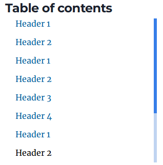

A lot of people, I included, are using Gatsby to build their own blogs. One of the things I wanted to add to my blog
was a table of contents (ToC) 📝. A ToC will show you all the headings of an article and when you click on a heading it'll
take you directly to that heading.
It's a nice little feature to have on your blog, which makes it easier for users to navigate and find the information
they are looking for.

`youtube: YrUeiD4YO5E`

## Prerequisite

So before we get started you can find the [source code here](https://gitlab.com/hmajid2301/).
In this article, I will be using the
[gatsby-starter-blog](https://www.gatsbyjs.com/starters/gatsbyjs/gatsby-starter-blog/).

```bash
# If you don't have the CLI installed, run this command.
npm -g install gatsby-cli

gatsby new my-gatsby-project https://github.com/gatsbyjs/gatsby-starter-blog
```

If you already have an existing Gatsby site, you can make the changes directly there instead of
using this starter.

## Plugins

We need to get some extra plugins installed for the ToC to work properly.

```bash
yarn add gatsby-remark-autolink-headers gatsby-plugin-emotion
```

The plugin `gatsby-remark-autolink-headers` turns all of the headers into anchor links. This means we can link to the
headers.

:::note Emotion
You only need to add the emotion plugin if you want to use emotionjs, which is a css-in-js solution.
You will see this later when we look at the `toc.js` component.
:::

```js{1-2,5}:title=gatsby-config.js
`gatsby-plugin-emotion`,
`gatsby-plugin-smoothscroll`,
{
    resolve: `gatsby-transformer-remark`,
    options: {
        plugins: [
            // ...
            `gatsby-remark-autolink-headers`,
        ],
    },
},
// ...
```

Our header elements with the `autolinks` plugin will now look something like:

```html
<h1 id="header-1" style="position:relative;">
  <a href="#header-1" aria-label="header 1 permalink" class="anchor before"
    >...</a
  >Header 1
</h1>
```

## ToC

First, let's design the ToC element. This component is just a presentation component, it doesn't contain any state logic.

```jsx:title=src/components/toc.js file=./source_code/src/components/toc.js

```

Let's break this component down. It receives a `heading` props, which it expects to be a list of the `headings`
from the markdown documents. A heading is an element starting with `#`, the more `#`s the lower the heading, for example:

```md
# Heading 1

## Heading 2

### Heading 3
```

We use the `heading.map` which will create an element for each of the `headings` in the list. If it's a "heading 5" or lower,
we will simply return an empty div, `heading.depth > 4`. This is so that the ToC doesn't become too "big" and
which would make it harder to use/navigate.

```js:title=src/components/toc.js
const ToC = ({ headings }) => (
  <Toc>
    <Title>Table of contents</Title>
    <InnerScroll>
      {headings.map((heading) => {
        if (heading.depth > 4) {
          return <div />;
        }

        return (
          <ToCElement key={heading.value}>
            <ToCLink
              href={`#${heading.value.replace(/\s+/g, "-").toLowerCase()}`}
            >
              {heading.value}
            </ToCLink>
          </ToCElement>
        );
      })}
    </InnerScroll>
  </Toc>
);
```

If it's a heading 1-4, we create a list element (`<li>`) with a link (`<a>`) inside of it. This will be a single
heading within our ToC. Below is an example ToC:



The heading data for the ToC above will look something like this:

```js
const headings = [
  {
    value: "Header 1",
    depth: 1,
  },
  {
    value: "Header 2",
    depth: 2,
  },
];
```

As discussed earlier we are using the `autolink` headers plugin. This plugin auto-generates anchor links for all of our header. We will use the `href` attribute to link to these headers in our ToC.

:::note href
The `href` link we replace all the whitespace with `-` so `"Heading 1"` becomes the anchor link `#heading-1`.

```jsx:title=src/components/toc.js
<ToCLink href={`#${heading.value.replace(/\s+/g, "-").toLowerCase()}`}>
  {heading.value}
</ToCLink>
```

:::

### Twin Macro & EmotionJS

Now in the above `ToC` component, you see elements like `<ToCElement>`, `<InnerScroll>` and `<ToC>`.
Where are these components coming from? Well, this is why I said we need to use the gatsby emotion plugin.
This is the css-in-js components, these components above are twin.macro or emotionjs components.
To use it within our code run the following commands:

```bash
yarn add twin.macro @emotion/core @emotion/styled
npx tailwind init
vim package.json
```

```json:title=package.json
"babelMacros": {
    "twin": {
        "config": "tailwind.config.js",
        "preset": "emotion",
        "dataTwProp": true,
        "debugPlugins": false,
        "debug": false
    }
}
```

:::info TailwindCSS with Gatsby
Gatsby have a good tutorial [here](https://www.gatsbyjs.com/docs/tailwind-css/), on how to integrate
TailwindCSS with a Gatsby site.
:::

The `twin.macro` library allows us to use [`TailwindCSS`](https://tailwindcss.com/). Tailwind provides us with
many pre-generated classes that we can then leverage within our code. Here I am assuming you are somewhat familiar with how it works.

```jsx:title=src/components/toc.js
const Toc = styled.ul`
  ${tw`bg-white fixed hidden lg:flex flex-col rounded p-3 my-3`};
  width: 20rem;
  left: calc(50% + 400px);
  top: 80px;
  max-height: 30vh;
`;

const Title = tw.h2`text-2xl mb-2`;

const ToCElement = tw.li`p-1 leading-5 ml-4 mb-4 mr-4 leading-3 list-none`;

const ToCLink = tw.a`hover:text-black transition duration-300 no-underline`;

const InnerScroll = styled.div`
  scrollbar-width: thin;
  scrollbar-color: #367ee9 rgba(48, 113, 209, 0.3);
  overflow: hidden auto;
`;
```

This is how we can style the scrollbar. The first colour is the colour of the scrollbar and the second colour is the
the background colour of the scrollbar.

```jsx:title=src/components/toc.js
const InnerScroll = styled.div`
  scrollbar-width: thin;
  scrollbar-color: #367ee9 rgba(48, 113, 209, 0.3);
  overflow: hidden auto;
`;
```

:::note div
The `styled.div` this means `InnerScroll` when translated to HTML code will be `<div>`.

```html
<div class="css-91zyin-InnerScroll eqpue8b4">
  <li class="css-12965kf-ToCElement eqpue8b2">
    <a href="#header-1" class="css-14n9u33-ToCLink eqpue8b3">Header 1</a>
  </li>
</div>
```

:::

Another interesting component to look at is the `ToC`. This combined twin.macro and emotionjs
so `width` CSS is using emotionjs and we are using twin.macro with `{tw`...`}`. Where we fill in
the `tw` with the tailwind styles we want to apply. In the example below, `fixed` will make
the position of the element fixed.

```jsx:title=src/components/toc.js
const Toc = styled.ul`
  ${tw`bg-white fixed hidden lg:flex flex-col rounded p-3 my-3`};
  width: 20rem;
  left: calc(50% + 400px);
  top: 80px;
  max-height: 30vh;
`;
```

## Global Style

One small change we need to make to allow our scrolling to be smoother is in our global styles,
whether that should be a CSS file or a css-in-js etc. In this example, it'll be the `style.css` file that comes with
the start. We need to add the following properties:

```css:title=src/style.css
html {
  scroll-behavior: smooth;
  // ...
}
```

This CSS property will stop the scrolling from feeling jerky and instead will be far smoother. So instead of jumping to the header, we click on a header in the `ToC` and it'll scroll smoothly to that header.

## Blog Template

Finally, we need to add the ToC element to our blog template.

### Gatsby Node

Remember that with Gatsby in the `gatsby-node.js` file, we can create a new page for each markdown file found. Here
is the logic that creates a page for each markdown file found by the `markdown-remark` plugin. As you can see, we use
`blog-post.js` file as the template for each of our blog posts.

```js:title=gatsby-node.js
exports.createPages = async ({ graphql, actions, reporter }) => {
  const { createPage } = actions;

  // Define a template for blog post
  const blogPost = path.resolve(`./src/templates/blog-post.js`);

  // Get all markdown blog posts sorted by date
  const result = await graphql(
    `
      {
        allMarkdownRemark(
          sort: { fields: [frontmatter___date], order: ASC }
          limit: 1000
        ) {
          nodes {
            id
            fields {
              slug
            }
          }
        }
      }
    `
  );

  const posts = result.data.allMarkdownRemark.nodes;

  // Create blog posts pages
  // But only if there's at least one markdown file found at "content/blog" (defined in gatsby-config.js)
  // `context` is available in the template as a prop and as a variable in GraphQL

  if (posts.length > 0) {
    posts.forEach((post, index) => {
      createPage({
        path: post.fields.slug,
        component: blogPost,
      });
    });
  }
};
```

### Gatsby Config

To allow the remark plugin to "see" the markdown files, we need to source them. There are a few ways to do this,
I normally use [git to source my plugins](/blog/gatsby-articles-git-gitlab-ci). In this case, we will add all
the markdown files in the `content/blog` folder.

```js:title=gatsby-config.js
{
    resolve: `gatsby-source-filesystem`,
    options: {
        path: `${__dirname}/content/blog`,
        name: `blog`,
    },
}
```

### Blog Post

So now back to our `blog-post.js`, let us add our `ToC` component to the blog post template.

```jsx:title=src/templates/blog-post.js
import ToC from "../components/toc";
// ...

const post = data.markdownRemark;
return (
    <Layout location={location} title={siteTitle}>
        <article className="blog-post" itemScope itemType="http://schema.org/Article">
            <ToC headings={post.headings} />
        </article>
    </Layout>;
)
```

Let's also adjust the GraphQL query so we can get the heading data that the ToC component requires.
Add the `headings` field to get the value and the depth fields.

```graphql:title=src/templates/blog-post.js{5-8}
markdownRemark(id: { eq: $id }) {
    id
    excerpt(pruneLength: 160)
    html
    headings {
        value
        depth
    }

    frontmatter {
        title
        date(formatString: "MMMM DD, YYYY")
        description
    }
}
```

That's that we added a ToC to our Gatsby Site. We can a bunch of other things to improve it. Such as
styling it to make it look better. I also hide my ToC when the width decreases. So you only see a ToC when
browsing the site on a Laptop/Desktop.

## Appendix

- [Source Code](https://gitlab.com/hmajid2301/articles/tree/master/38.%20ToC%20in%20Gatsby/source_code)
