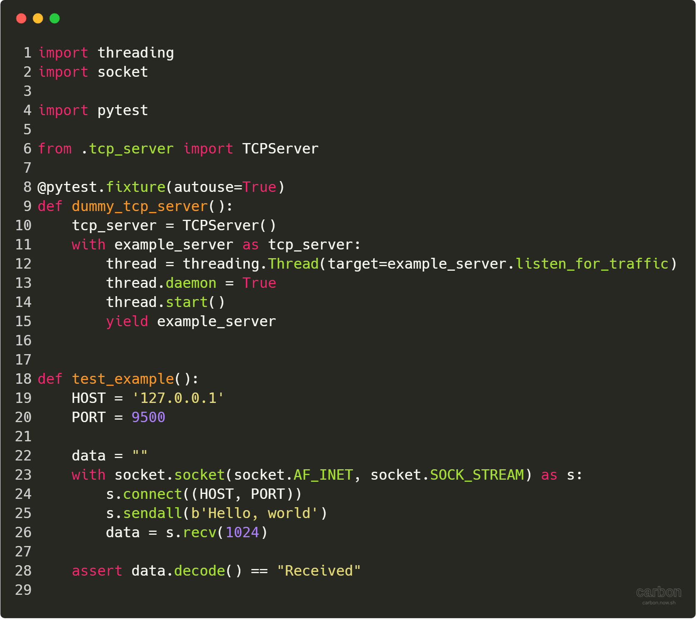

# Pytest with Background Thread Fixtures


Recently I had to test some of my Python code which required an external dependency and communicating by using TCP sockets. You can think of this dependency as essentially a database because it stored information. However, when testing my Python code, I couldn't rely on there always being a TCP server to send messages to. 

So I ended up creating a simplified mocked version in Python. This way I could run automated tests on my code without needing to either install/rely on this server already existing there. Essentially I ended up creating a TCP server in Python, which would receive some input and respond how I would expect the real TCP server too.

I write my tests using Pytest for several reasons, I prefer it to unittest because it required less boilerplate code. It also has lots of useful features such as fixtures. However, when creating tests for my API I realised that I had to first start the fake TCP server. But since it was always listening for traffic it would block the rest of my tests from running. So in this example, I will show you how you can create a Pytest fixture and run it on a background thread (TCP server) and still run your tests as normal.

---------------------------------------------------------------------------------------------------

## tcp_server.py


This is a very basic TCP server, it received some input but always replies with "Received". Also, I created the class to be used with the context manager so that the socket can be closed, hence the _\_\_enter\_\__ and _\_\_exit\_\__ dunder (magic) method. This TCP server will always listen on localhost on port 9500, this is the same port the client will also have to connect to, to send messages to this TCP server.

The main function of interest is _listen\_for\_traffic_, which loops forever whilst listening for traffic. If it receives any data, it always replies with "Received", of course with a real server we might want to do something more interesting but to keep this example simple that's all this server will do.

---------------------------------------------------------------------------------------------------

## test_example.py



When you run the Pytest command it will automatically run tests on all modules and method that start with "test_". I have created a fixture (using the fixture decorator), fixtures allow for code reuse within a Pytest module. Fixtures are typically used to connect to databases, fixtures are the run before any tests hence we can also use them to setup is code.

So taking a look at the dummy_tcp_server() function, first we use a context manager (with) to set up our TCP server.

```python
with example_server as tcp_server:
```

This calls the _\_\_enter\_\_()_ dunder method, which starts up our TCP server and so it's now listening for any traffic on port 9500.  

```python
thread = threading.Thread(target=example_server.listen_for_traffic)
thread.daemon = True
thread.start()
```

This is the bit of code that actually runs our TCP server on another (background) thread. So the in the first line we tell the thread what function to call, _listen\_for\_traffic_ has an infinite while loops just waiting to listen for traffic arriving on port 9500. We set the thread as a daemon so that when we close the main Python program the thread will automatically kill itself, this means we don't have to manage it yourself.

```python
yield example_server
```

The yield is very similar to a return statement. The main reason I choose to include is that if the tests for some reason raise an exception, the yield will still allow the context manager to exit. If we had any tear down code after the yield even with an exception, this code will still run after all the tests have finished. Also yields (and return statements) allow individual tests to access functions from the TCPServer class. For example, if you had a function (in the TCPServer class) that stored every message sent to the server. If you pass the fixture as a parameter to any tests then you could access this function.

```python
def test_example():
    HOST = '127.0.0.1'
    PORT = 9500

    data = ""
    with socket.socket(socket.AF_INET, socket.SOCK_STREAM) as s:
        s.connect((HOST, PORT))
        s.sendall(b'Hello World')
        data = s.recv(1024)

    assert data.decode() == "Received"
```

The part of our code is the actual test. It sends "Hello World" to the TCP server, remember if you sent it as string (without _b''_) then you'll have to encode that string first (_"Hello World".encode()_). Then we capture the response from the server and decode it (because it's in binary, this converts it into a string) and assert or check that the data is the string "Received" as we expect..

---------------------------------------------------------------------------------------------------

## Appendix

* [Example source code](https://github.com/hmajid2301/medium/tree/master/Pytest%20with%20Background%20Threads)
* [Pytest](https://docs.pytest.org/en/latest/)
* [Code images made with carbon](https://carbon.now.sh)