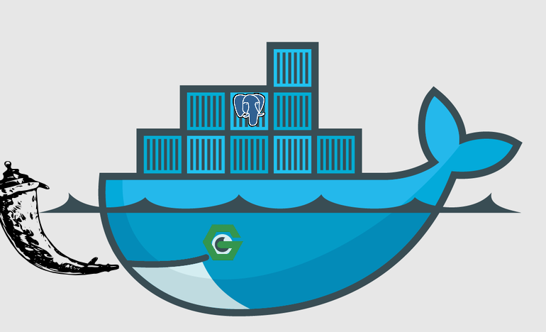
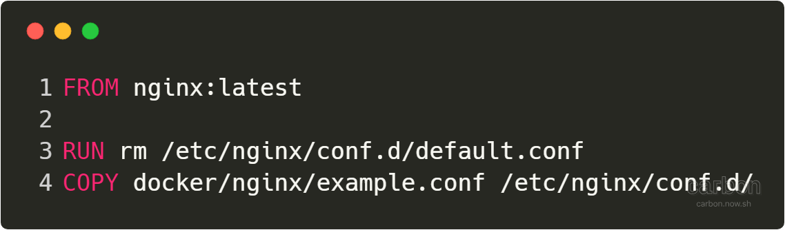
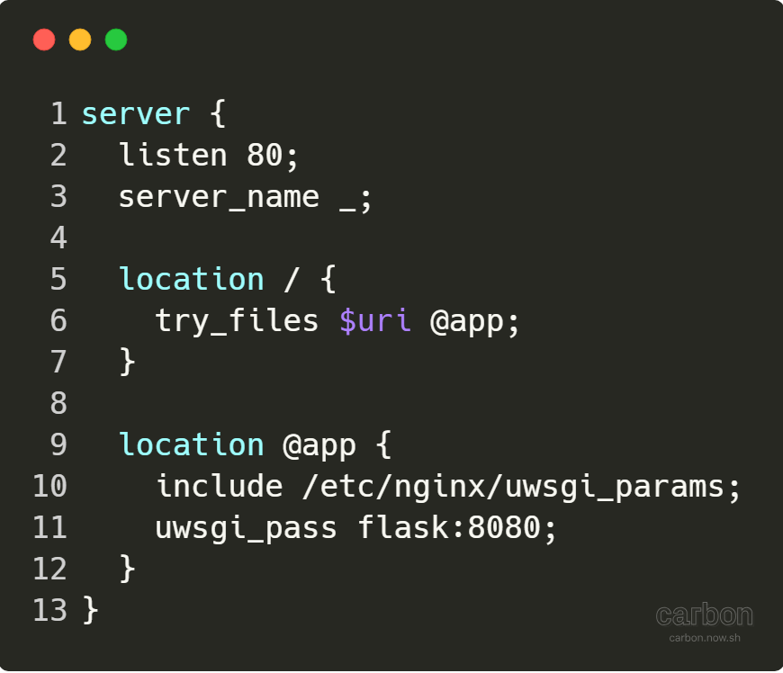
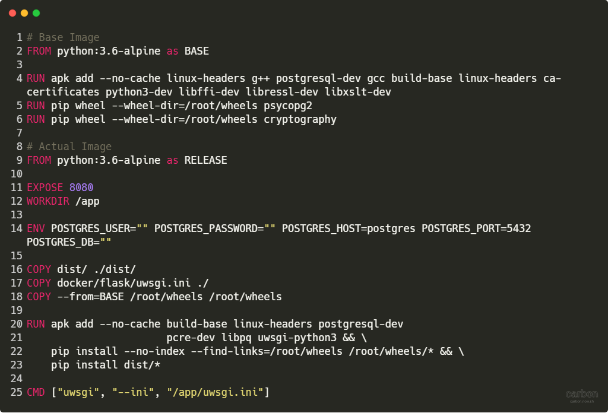
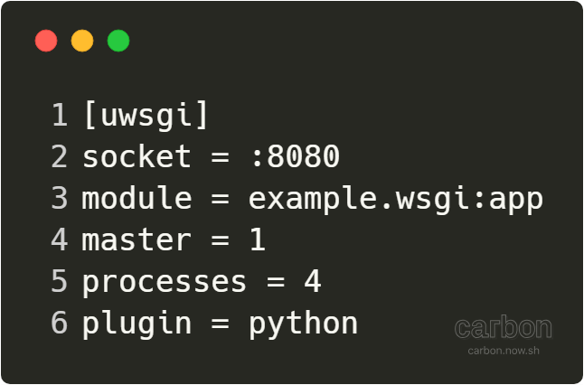
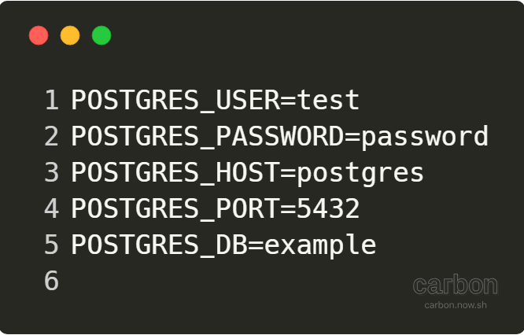
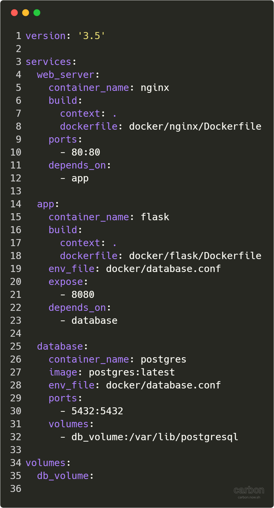

# Using Multiple Docker Containers to Setup Nginx, Flask and Postgres



## Terminology

* Docker Image: Is a file used to execute code in a Docker container, built from a set of instructions.
* Docker Container: Is a Docker image that is being executed or run.

---------------------------------------------------------------------------------------------------

Docker :whale: is a relatively new and exciting technology, Docker is a containerisation tool. The main benefits of using Docker is that you can
use the same environment for development, testing and production. Since Docker environments are consistent this means if the application works
in the testing environment it will also work in production.

Another big advantage of Docker is that I don't need to download all the dependencies on my own machine directly. To build an entire application and run it all I need is a Dockerfile so if I'm the go a lot and using lots of different machines, I can easily set up my own development environment simply by using Docker. All Docker does it execute a set of instructions so since the instructions are the same, the environment Docker will create (Docker container) will also be the same.

In this tutorial, I will show you how to set up a Python :snake: application using multiple Docker containers. In theory, you could have one big Docker container
that has Nginx, Flask and Postgres but I prefer to split the application up. For example into its core components, web server (Nginx), application (Flask) and
database (Postgres). The main advantage of this is that it makes it easier to replace components of the application and also makes it easier to detect errors
as you can see which container is cauing the error.

**Note**: Everything in this tutorial has been tested on Ubuntu Linux.

---------------------------------------------------------------------------------------------------

## Prerequisites

* [Install Docker](https://docs.docker.com/install/)
* (optional) [Install docker-compose](https://docs.docker.com/compose/install/)

---------------------------------------------------------------------------------------------------

## Nginx

The first Docker container called Nginx will be the main gateway into our application it will be used as a proxy server. It will receive HTTP requests and forward them onto our Python application.

### Dockerfile



This is a very simple dockerfile that takes uses the latest Nginx docker image. It then removes the default configuration and adds our configuration.

### example.conf



This is a simple Nginx configuration file which listens for traffic on port 80 (HTTP). It then passes on the data to uWSGI (hence `location /`). We then pass the HTTP request to another Docker container called `flask` on port 8080. This configuration cannot be used for https. **Warning** Only use https to send secure data. The reason we give it the container name `flask` rather than `localhost` is because this is how Docker networking works by default (bridge networking) to allow container to container communication. We do a something thing to allow when connecting Flask container to the Postgres container.

---------------------------------------------------------------------------------------------------

## Flask

NOTE: Link to the [Python app source code](https://github.com/hmajid2301/medium/tree/master/7.%20Multi%20Docker%20Container%20with%20Nginx,%20Flask%20and%C2%A0MySQ) in `source_code/src/example/` this is the code that is turned into the `tar` in the `dist` folder.

The second Docker container will contain our Python application running on a uWSGI server. The uWSGI server is a web application server based on the WSGI specification will allow Python to communicate with web servers. In this case, it essentially acts as middleware between Nginx and Flask translating requests between them. So essentially uWSGI receives an HTTP request from Nginx and translates into something Flask can understand. This container stores all the core Python code required for this simple API.

### Dockerfile



This dockerfile uses a relatively new Docker feature called multi-stage builds. Here we use a base image (Python3.6) to generate some Python wheel files. These wheel files require specific Linux dependencies that we don't actually need in our main Docker container. Then we define our actual image and copy over the wheel files that we need for our application. This is done to help reduce the size of our Docker image file, we want to try to make the image as possible (as much as it makes sense). At the end of the dockerfile, the `BASE` image is destroyed.

So our actual Docker image is a bit more interesting. It does the following;

* It exposes port 8080, this actually doesn't do anything but is simply for documentation purposes
* It then creates a default directory `/app/`
* We define some environment variables that are required by this container (all used to connect to Postgres). **Please Note** in a production environment you don't want to expose passwords and username as environment variables on your docker containers, instead, you should use a secrets stores such as [HashiCorp Vault](https://www.vaultproject.io/). These variables will be defined when we run the container
* It copies the `dist` folder which has our Python package as a tar file. You can generate this file if you have a `setup.py` file and run `python setup.py sdist` in the same folder as your `setup.py`
* It copies the `uwsgi.ini` used to configure the uWSGI server
* It copies all the wheels folder from the `BASE` image hence the `--from=BASE`
* Then we install the wheels and our everything in the `dist` folder, which our Python code as a `tar`
* Finally when the Docker image will be run it will execute `uwsgi --ini /app/uwsgi.ini`. Using the uwsgi.ini file we copied into the image

In theory, you could simply copy and install the requirements.txt and copy all the source code to the `/app` folder. However, I prefer to generate and install the actual Python package I think it's cleaner and you only have to copy a single `tar` file. However, this does require you to run the command to generate the `dist` folder before you try to build the Docker image.

### uwsgi.ini



This is the configuration file used by the uWSGI server. This is where we define which port uWSGI listens for traffic on in this cases it's 8080. **Note** that since we've defined `socket` you cannot access the uWSGI server directly you need a web server in front of it, if you wanted to use just uWSGI you would change this option to `http`. The other import option is the `module`, we point it to our installed module example then the wsgi module and app variable. Hence the `module=example.wsgi:app`. In this example the `wsgi.py` module calls `create_app()` function which creates the Flask app.

---------------------------------------------------------------------------------------------------

## Postgres

The Postgres image is simpler the latest Postgres image from Docker hub, then we pass some environment variables to it to configure it.

## database.conf



The environment variables passed look something like this.
**NOTE** You don't need to pass the port or the host to Postgres Docker container. These are used by the Flask container.

---------------------------------------------------------------------------------------------------

## docker-compose.yml

So we've defined our dockerfile and configuration files used by those dockerfiles but how do we actually use Docker. One way we can use docker is to define it using docker-compose. Here we define a set of services and Docker will automatically run and build those services and handle the networking for us. I personally use docker-compose for development as it saves a lot of time running the `docker build` and `docker run` commands for each Docker image/container.



So at the top of the file we define the version number of docker-compose, it is recommended that users use version 3 now. Then we define our services, one service equals one Docker container. Each service is given a name, such as web_server, app and database.

### web_server

This service runs our Nginx server. We call the container `nginx` for obvious reasons. We pass it the location of the dockerfile to build. The build `context: .` simply means relative to this current working directory so we when we COPY file we will copy them relative to docker-compose.yml file. The final thing we do publish our ports so all traffic on the host machine on port 80 is mapped to the Docker container also on port 80. We could use any port on our guest machine say we used 8001, then we would access the web server by going to `localhost:8001`. The final part specifies this container depends on the app container so app will be run before this container.

### app

This is a relatively simple service, again we point it to our flask dockerfile and set build context to the current folder. Then we pass some environment variables as a file, the variables are taken from this file (same `database.conf` as defined above). These variables are used to allow Python to connect to the database. Finally, we expose port 8080, again this for documentation purposes so other users know this container expects traffic on port 8080. Since we need to connect to the database when we set up our app we depend on the database container being run first.

### database

This service doesn't have its own dockerfile but instead uses the official Postgres image. It then passes some environment variables as a file, the same file that gets passed to Flask container. We don't actually need the host or port variables but it's easier to maintain a single file in this case. We then map the host port 5432 to the guest Docker container port 5432. This is the port that Postgres listens on. Like with Nginx you can set the host port to whatever you want, but make sure you change this in `database.conf` and update `POSTGRES_PORT` variable. Finally, we mount a volume so that data is persistent, without this when the database Docker container was killed you would lose all your data. By mounting `db_volume` even you kill the container to say update the Postgres image your data will persist.

### Docker Compose Build/Run

To actually run the docker-compose file (in the same folder as `docker-compose.yml`), you can do something like below. Where `-d` means it runs in the background. This will build all three services and once it has built our Docker images it will run those Docker images as Docker containers.

```bash
docker-compose up --build -d
```

### Docker Build/Run

One important thing to note is `docker-compose` should not really be used in production for several reasons, such as downtime when updating your Docker containers. If your deploying to only 1 host docker-compose should be fine but in reality, most applications required high availability and zero downtime updates, in this case, you should at using a container orchestration tools such as Kuberenetes. So an alternative approach is to build and run each Docker container yourself, the equivalent commands for this `docker-compose.yml` file would be.

```bash
# Build our images first
docker build -f docker/nginx/Dockerfile -t nginx .
docker build -f docker/flask/Dockerfile -t flask .

# Run our containers
docker run -d --name nginx -p 80:80 nginx
docker run -d --name flask -p 8080  --env-file docker/database.conf flask
docker volume create --name db_volume
docker run -d --name postgres -p 5432:5432 \
           --env-file docker/database.conf \
           -v db_volume:/var/lib/postgresql postgres:latest
```

**Note**: After you've built your own images you can push them to either a public or private Docker registry so you or other people can access them. This is a common way to access your images during your CI pipeline. In fact base images like `postgres:latest` are taken from the [official Docker registry](https://hub.docker.com/_/postgres/).

---------------------------------------------------------------------------------------------------

## Appendix

* [Example source code](https://github.com/hmajid2301/medium/tree/master/7.%20Multi%20Docker%20Container%20with%20Nginx,%20Flask%20and%C2%A0MySQL)
* [Code images made with carbon](https://carbon.now.sh)
