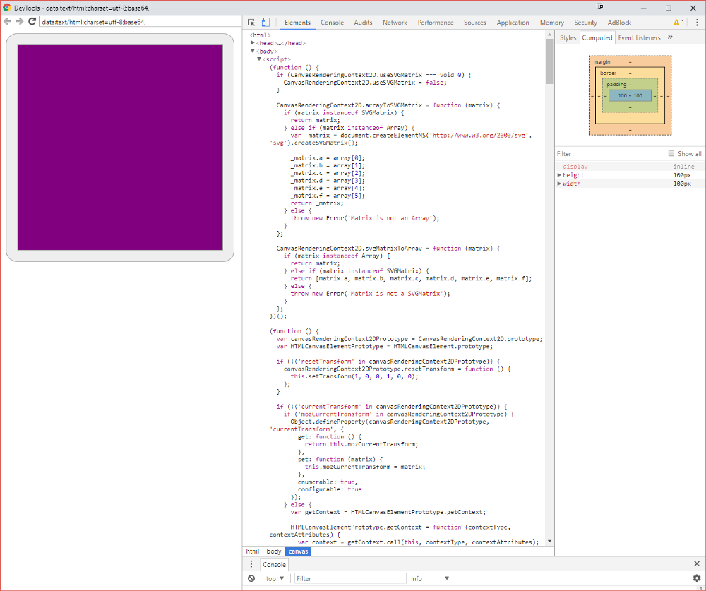
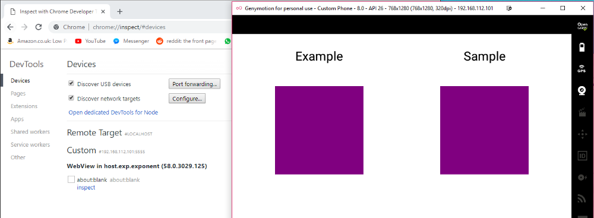

# Debug Expo/React Native WebView

The “core” logic of my React Native app involves using WebViews because I need to access the HTML5 canvas. Whilst developing this code there are bound to be errors and issues with the WebView code. Figuring out how to debug code within the WebView isn’t so obvious.

---------------------------------------------------------------------------------------------------

## Chrome Inspect

* Start your Expo/React Native app*.
* Open and chrome and then go to the following URL, [chrome://inspect](chrome://inspect).
* Then click on the “inspect” button, click the top link to open the latest WebView, you should see something similar to Figure 2.
* You should see something similar to Figure 1. Now you explore the WebView like a normal web page.

---------------------------------------------------------------------------------------------------

## Appendix

*Make sure to do this on the same machine/host that is running the emulator. For example, a Genymotion VM is running on my Windows machine but I can still see it’s WebViews on the chrome inspect URL. This can be seen in Figure 3.

### Links

* [With help from this StackOverflow post](https://stackoverflow.com/questions/47711418/debugging-webview-in-react-native-apps?rq=1)
* [Genymotion](https://www.genymotion.com/)