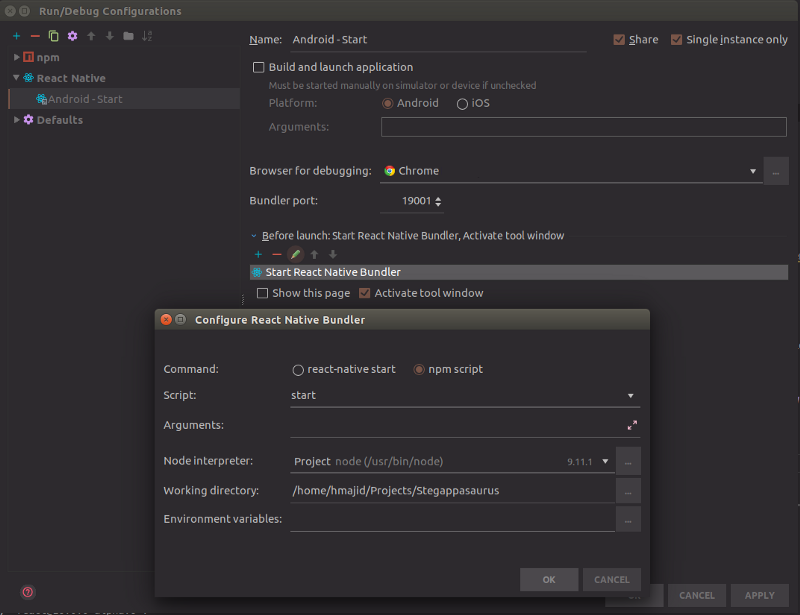

# Debugging Expo apps in WebStorm and Visual Studio Code


Visual Studio Code and WebStorm are two popular editors for developing React Native/Expo apps. These editors have lots of useful features, such as syntax highlighting, git integration and auto completion. However working out to debug Expo apps can be a bit confusing.

One of the main advantages of working in an editor/IDE (let us be honest Visual Studio Code is pretty close to an IDE) is being able to use a debugger (and breakpoints) to go through your code line by line and see which part of your code is not running as expected. Debuggers can be a powerful tool when trying to remove bugs from your software, being able to stop your code at any point and check the state, analyse variables etc.

You can actually debug, with breakpoints and all those other fancy features, your Expo apps in both IDEs (WebStorm and Visual Studio Code). I will be running my app in a [Genymotion Android emulator](https://genymotion.com/). Also please note there are likely several ways to debug your React Native/Expo app , I’m simply showing you the way I was able to get my debugger running.


---------------------------------------------------------------------------------------------------

## Prerequisite

* Have an [Expo](https://expo.io/learn) app
* Turn on “Debug JS Remotely” on your android device, as shown in Figure 1. In Genymotion you can open the “Developer Menu” menu by pressing CTRL + M. More information [here](http://facebook.github.io/react-native/docs/debugging)
* Connect to your Android device using ADB

`adb connect 192.168.101.1 # Replace with your Device IP`


---------------------------------------------------------------------------------------------------

## WebStrom

* Install and turn on CORS plugin in Chrome, make sure it's the same chrome browser you use in your configuration. (NOTE make sure your aware of the security implication on using CORS, switch the plugin off when your not using it).
* Open WebStorm and your Expo project
* Add the following lines of code to your "package.json" file

```json
"scripts": {
    "start": "exp start"
}
```

* Create a new configuration of type "React Native" with the settings shown in Figure 3. Remember to add a new the "Before launch" configuration and select configuration type "React Native Bundler"
* Run the configuration you just created in debug mode (SHIFT + F9)
* Open a terminal window and run

`exp android`




---------------------------------------------------------------------------------------------------

## Visual Studio Code

* Open Visual Studio Code and your Expo project
* Create a new file in your .vscode folder called "settings.json" and add the following

```json
{
    "react-native": {
        "packager": {
            "port": 19001
        }
    }
}
```

* Go to "Debug" window (CTRL + SHIFT + D)
* When prompted for environment choose "React Native", it should give an "launch.json" file like this, make sure it contains the following

```json
{
   [
        {
            "name": "Attach to packager",
            "program": "${workspaceRoot}/.vscode/launchReactNative.js",
            "type": "reactnative",
            "request": "attach",
            "sourceMaps": true,
            "outDir": "${workspaceRoot}/.vscode/.react"
        },
  
    ]
}
```

* Open the integrated terminal (CTRL + `) and run

`exp start`

* On top of the Debug menu should say "Debug Android" change this to "Attach to packager" and press "Start Debugging"
* Open another terminal and run

`exp android`

* Swap to "Debug Console" tab to see the debugger


---------------------------------------------------------------------------------------------------

## Appendix

* GIFs created with [screentogif](https://www.screentogif.com/)
* ["Debugging create-react-native-app with VSCode"](https://medium.com/r/?url=https%3A%2F%2Fwww.youtube.com%2Fwatch%3Fv%3D0_MnXPD55-E)
* ["WebStorm 2018.1 EAP, 181.3263.21: improvements for React Native, extract Vue component"](https://blog.jetbrains.com/webstorm/2018/02/webstorm-2018-1-eap-181-3263/)
* Icon made by [Monik](https://www.flaticon.com/authors/monkik) from [FlatIcon](https://www.flaticon.com/)and is licensed by [Creative Commons 3.0](http://creativecommons.org/licenses/by/3.0/)